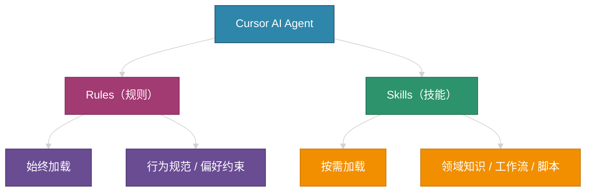
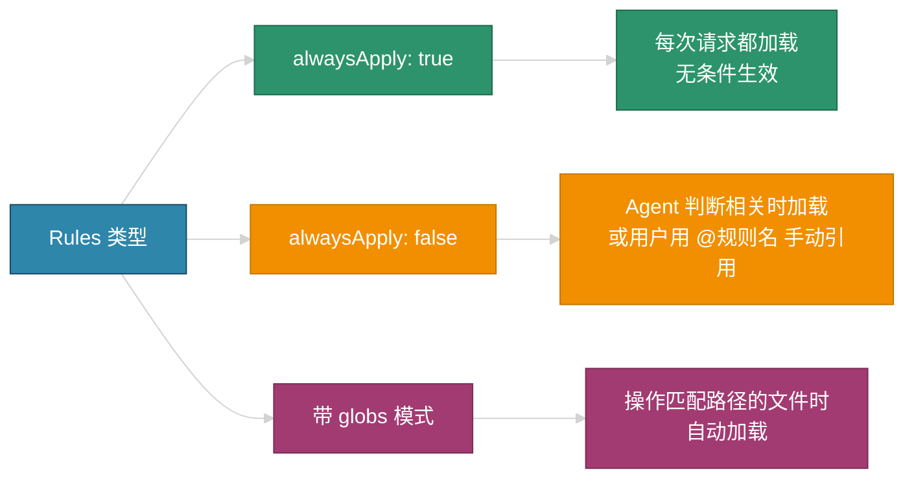
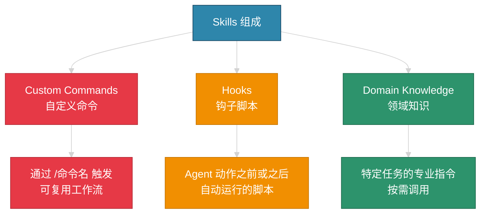
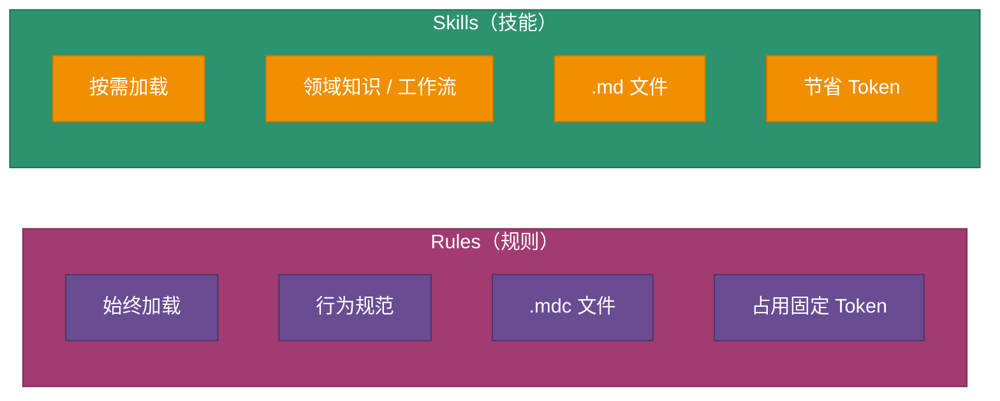
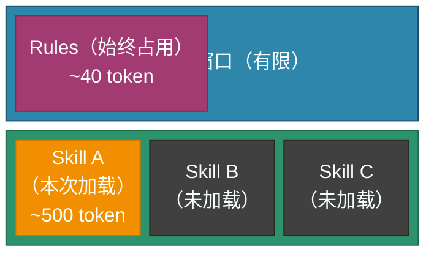
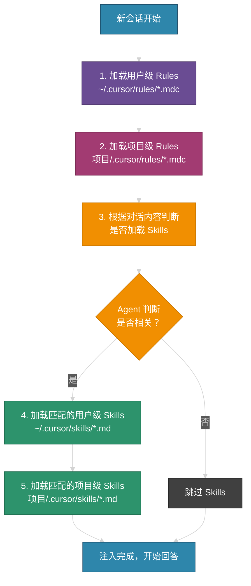
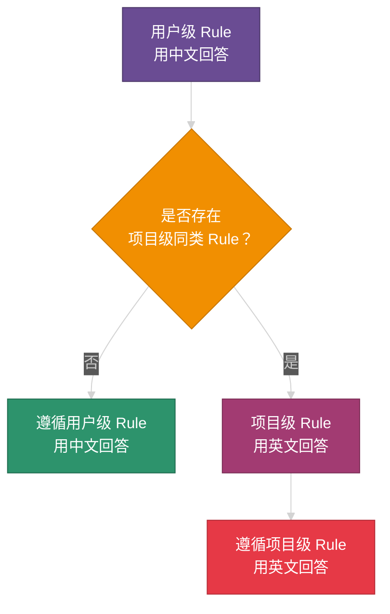
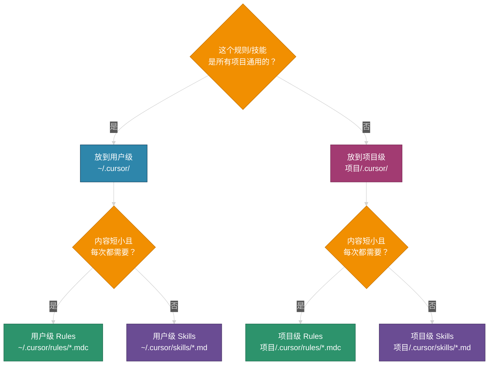
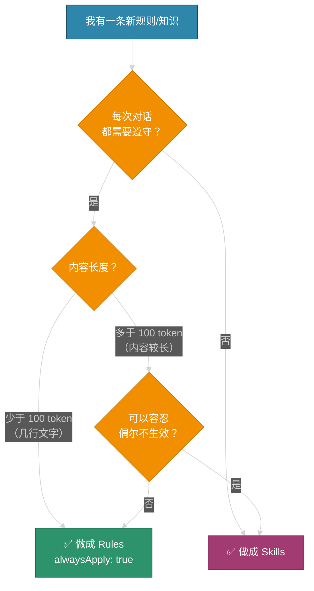

# Cursor Rules 与 Skills 完全指南

> 本文档详细介绍 Cursor IDE 中 Rules 和 Skills 的加载顺序、优先级、区别及适用场景。

---

## 目录

1. [概念总览](#1-概念总览)
2. [Rules 详解](#2-rules-详解)
3. [Skills 详解](#3-skills-详解)
4. [Rules vs Skills 对比](#4-rules-vs-skills-对比)
5. [加载顺序与优先级](#5-加载顺序与优先级)
6. [文件存放位置](#6-文件存放位置)
7. [适用场景指南](#7-适用场景指南)
8. [最佳实践](#8-最佳实践)

---

## 1. 概念总览

Cursor 提供了两种机制来定制 AI Agent 的行为：**Rules（规则）** 和 **Skills（技能）**。它们各自承担不同的职责，共同构成 Agent 的"知识体系"。



### 简单类比

把 AI Agent 想象成一个新入职的员工：

- **Rules** = 公司规章制度（入职就得看，时刻遵守）
- **Skills** = 专业工具箱（做木工时拿木工工具，做电工时拿电工工具，不会一次全背在身上）

---

## 2. Rules 详解

### 2.1 什么是 Rules

Rules 是用户编写的**行为准则和偏好**，告诉 AI 在回答和操作时应该遵守什么规范。Rules 定义在 `.mdc` 文件中，存放在 `.cursor/rules/` 目录下。

### 2.2 Rules 的类型



### 2.3 Rules 文件格式

Rules 使用 `.mdc` 扩展名，文件头部使用 YAML Front Matter 定义元数据：

```yaml
---
alwaysApply: true
---
# 规则标题

- 规则内容 1
- 规则内容 2
```

### 2.4 Rules 的典型用途

| 用途 | 示例 |
|------|------|
| 语言偏好 | "始终用中文回答" |
| 代码风格 | "使用 4 空格缩进，禁止使用 var" |
| 通用编码规范 | "每个函数必须有注释" |
| 输出格式偏好 | "回答尽量简洁" |

---

## 3. Skills 详解

### 3.1 什么是 Skills

Skills 是封装了**特定领域知识、工作流和脚本**的能力模块。Skills 定义在 `.md` 文件中，存放在 `.cursor/skills/` 目录下。与 Rules 不同，Skills 只在 Agent 认为相关时才动态加载。

### 3.2 Skills 的三大组成部分



### 3.3 Skills 文件格式

Skills 使用标准 `.md` 文件，不需要 YAML Front Matter 中的 `alwaysApply` 字段：

```markdown
# Skill: 技能名称

当用户要求执行某某操作时，必须遵循以下规则。

---

## 规则 1
...

## 规则 2
...
```

### 3.4 Skills 的典型用途

| 用途 | 示例 |
|------|------|
| 文档导出规范 | "导出 Markdown 时使用 Mermaid 画图" |
| 格式转换规则 | "Mermaid 时序图转 Draw.io 格式" |
| 开发指南 | "RK3588 设备树编写规范" |
| 调试流程 | "触摸屏驱动调试步骤" |
| 部署工作流 | "内核编译和烧录流程" |

---

## 4. Rules vs Skills 对比

### 4.1 核心差异



### 4.2 详细对比表

| 维度 | Rules | Skills |
|------|-------|--------|
| **加载方式** | 始终包含在上下文中 | Agent 判断相关时动态加载 |
| **文件格式** | `.mdc`（含 YAML Front Matter） | `.md`（标准 Markdown） |
| **存放目录** | `.cursor/rules/` | `.cursor/skills/` |
| **目的** | 行为规范、偏好约束 | 封装领域知识、工作流、脚本 |
| **Token 消耗** | 每轮都占用 | 按需占用，不相关时不消耗 |
| **内容特征** | 短小精悍（通常 < 100 token） | 可以很长（几百到上千 token） |
| **适合内容** | 全局偏好、通用规范 | 特定场景的详细指南 |
| **可靠性** | 100% 每次生效 | 依赖 Agent 判断，有概率不加载 |
| **手动触发** | `@规则名` | `/命令名` 或自然语言描述 |

### 4.3 上下文窗口占用示意



---

## 5. 加载顺序与优先级

### 5.1 加载顺序



### 5.2 同目录多文件排列

同一目录下有多个 `.mdc` 或 `.md` 文件时，按**文件名的字母顺序**排列加载：

```
a-coding-style.mdc  →  b-language.mdc  →  c-testing.mdc
```

### 5.3 优先级规则

| 优先级 | 来源 | 说明 |
|--------|------|------|
| 最高 | **项目级** `<project>/.cursor/rules/` 或 `skills/` | 紧贴当前项目，最具针对性 |
| 其次 | **用户级** `~/.cursor/rules/` 或 `skills/` | 用户的全局偏好 |

> **"后来者居上"原则**：项目级规则排在用户级规则之后注入上下文，越靠后的内容在有冲突时越倾向于被 Agent 遵守。

### 5.4 冲突解决机制



**重要提示**：冲突解决不依赖文件名是否相同。Agent 是通过理解规则的**语义内容**来判断的。建议在覆盖规则中明确写上 "此规则优先于其他规则" 等字样，以增强可靠性。

---

## 6. 文件存放位置

### 6.1 目录结构总览

```
~/.cursor/                              ← 用户级（所有项目共享）
├── rules/
│   └── chinese-response.mdc            ← 始终生效的全局规则
└── skills/
    ├── markdown-export.md              ← 导出 Markdown 时的规范
    └── mermaid-to-drawio.md            ← Mermaid 转 Draw.io 的规范

<project>/.cursor/                      ← 项目级（仅当前项目生效）
├── rules/
│   └── project-specific-rule.mdc       ← 项目专属规则
└── skills/
    └── project-specific-skill.md       ← 项目专属技能
```

### 6.2 如何选择存放位置



---

## 7. 适用场景指南

### 7.1 应该使用 Rules 的场景

| 场景 | 示例 | 原因 |
|------|------|------|
| 语言偏好 | "始终用中文回答" | 每次都需要，不能遗漏 |
| 代码风格 | "使用 Tab 缩进" | 每次写代码都要遵守 |
| 输出格式 | "回答简洁，不超过 200 字" | 影响所有回答 |
| 安全约束 | "不要修改 production 分支" | 必须始终遵守 |
| 项目特定约定 | "变量名用驼峰命名" | 项目内始终有效 |

### 7.2 应该使用 Skills 的场景

| 场景 | 示例 | 原因 |
|------|------|------|
| 文档导出 | "导出 Markdown 的格式规范" | 只在导出时需要 |
| 格式转换 | "Mermaid 转 Draw.io 规则" | 只在转换时需要 |
| 开发指南 | "设备树编写完整指南" | 内容很长，不需要每次加载 |
| 调试流程 | "内核 panic 调试步骤" | 只在调试时需要 |
| 部署流程 | "固件打包和烧录步骤" | 只在部署时需要 |
| 特定硬件知识 | "RK3588 GPIO 引脚定义" | 只在相关开发时需要 |

### 7.3 决策流程图



---

## 8. 最佳实践

### 8.1 命名规范

- **Rules 文件**：`<功能描述>.mdc`，例如 `chinese-response.mdc`、`coding-style.mdc`
- **Skills 文件**：`<技能描述>.md`，例如 `markdown-export.md`、`devicetree-guide.md`
- 文件名统一使用**英文小写**，单词之间用连字符 `-` 分隔

### 8.2 内容编写建议

| 建议 | 说明 |
|------|------|
| 规则明确 | 使用"必须"、"禁止"等明确措辞，避免模糊表达 |
| 示例丰富 | 在 Skills 中提供正反示例，帮助 Agent 理解 |
| 覆盖声明 | 需要覆盖其他规则时，明确写上"此规则优先" |
| 适度拆分 | 不要把所有规则塞进一个文件，按功能拆分便于管理 |

### 8.3 验证方法

确认规则和技能是否被正确加载：

1. **直接询问 Agent**：在对话中问 "你当前加载了哪些 rules 和 skills？"
2. **查看 Context 面板**：点击对话界面的 Context 区域查看已加载的文件
3. **使用 `@` 查看**：在输入框输入 `@Rules` 查看可用规则列表
4. **观察行为**：检查 Agent 的回答是否遵循了预期的规则

### 8.4 注意事项

- **Rules 内容尽量精简**：因为每次都会加载，冗长的 Rules 会浪费宝贵的上下文 Token
- **Skills 描述要准确**：Skills 的标题和开头描述会影响 Agent 判断是否加载，写清楚触发场景
- **定期清理**：随着项目演进，及时删除过时的规则和技能
- **不要重复**：同样的内容不要同时放在 Rules 和 Skills 中

---

## 附录：当前配置示例

```
~/.cursor/
├── rules/
│   └── chinese-response.mdc       ← 全局语言规则（始终生效）
└── skills/
    ├── markdown-export.md          ← Markdown 导出规范（按需加载）
    └── mermaid-to-drawio.md        ← Mermaid 转 Draw.io 规范（按需加载）
```
