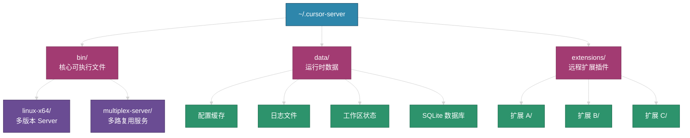
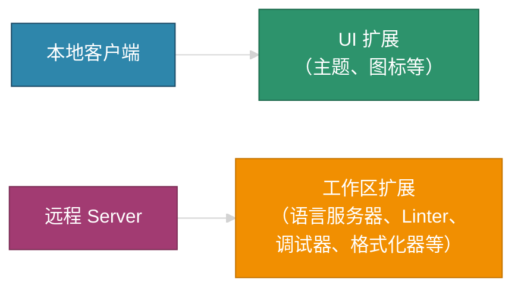
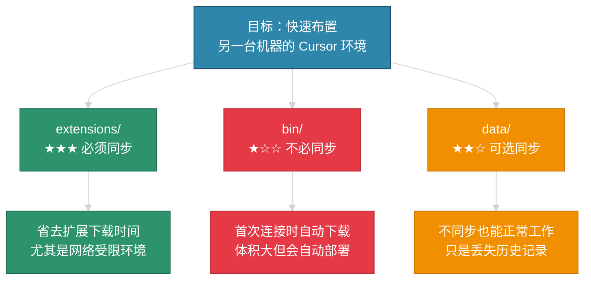

# Cursor Remote Server 目录结构详解（`~/.cursor-server`）

当通过 SSH Remote 连接远程机器时，Cursor 会在远程主机自动部署 `~/.cursor-server` 目录作为服务端运行环境。本文详细解析其内部结构、各目录职责、版本管理机制，以及跨机器迁移策略。

---

## 1. 整体目录概览

```
~/.cursor-server/
├── bin/            # 核心可执行文件（Server 引擎 + 多路复用）
├── data/           # 运行时数据与用户状态
└── extensions/     # 远程端安装的扩展插件
```



---

## 2. `bin/` — 核心可执行文件

### 2.1 目录结构

```
bin/
├── linux-x64/                           # 按平台架构分组
│   ├── 9d178a4a5589981b62546448bb32920a8219a5d0/   # commit hash 命名的版本
│   ├── 9675251a06b1314d50ff34b0cbe5109b78f848c0/
│   ├── 3fa438a81d579067162dd8767025b788454e6f90/
│   └── ...
└── multiplex-server/                    # 多路复用服务
```

### 2.2 版本管理机制

`linux-x64/` 下的每个子目录都以 **Git commit hash** 命名，对应 Cursor 的一个特定版本。每个目录就是一套完整的 Cursor Server 运行时。

以下面的实际目录为例：

| 目录（commit hash 缩写） | 创建时间 | 含义 |
|--------------------------|---------|------|
| `9d178a4a...` | 2025-10-29 22:28 | 最初连接时下载的版本 |
| `9675251a...` | 2025-10-30 11:12 | 次日升级，新版本 |
| `3fa438a8...` | 2025-10-31 17:20 | 第三天再次升级 |
| `8e4da76a...` | 2025-11-03 17:35 | 最近一次升级的版本 |

**关键规律**：

- **时间戳递增** = Cursor 客户端版本升级历史。每次本地 Cursor 更新后，首次 SSH 连接会自动将新版 Server 推送到远程并创建新目录
- **旧版本保留** — Cursor 不会自动清理旧版本，以便回退。但这会逐渐占用磁盘空间
- **仅最新版本生效** — 当前使用的是时间戳最新的那个目录

### 2.3 `multiplex-server/`

多路复用服务，允许多个 Cursor 窗口共享同一个 SSH 连接，减少连接开销。

### 2.4 磁盘空间优化

每个版本目录约占 **200-400 MB**，多个旧版本累积后非常可观。可以安全删除旧版本：

```bash
cd ~/.cursor-server/bin/linux-x64/

# 保留最新的，删除其余旧版本
ls -lt | tail -n +2    # 查看除最新外的旧版本
# rm -rf <旧版本hash目录>
```

> **注意**：只保留最新的一个 commit hash 目录即可。下次连接如果版本不匹配，Cursor 会自动重新下载。

---

## 3. `data/` — 运行时数据与用户状态

### 3.1 包含的内容

| 内容 | 说明 |
|------|------|
| **配置缓存** | 远程端缓存的用户设置（来自本地同步） |
| **日志文件** | Server 进程的运行日志、扩展日志 |
| **工作区状态** | 最近打开的文件夹、窗口布局、编辑器标签状态 |
| **Machine ID** | 远程机器的唯一标识，用于遥测和授权 |
| **SQLite 数据库** | 存储搜索索引、历史记录、补全缓存等 |

### 3.2 "历史记录"具体指什么

`data/` 中的"历史记录"主要包含以下几类：

1. **文件编辑历史（Local History）** — Cursor/VS Code 会在 `data/` 中保存文件修改的时间线快照，可以通过 "Timeline" 面板回溯到之前的文件版本（即使没有 Git）
2. **搜索历史** — 在远程工作区中执行过的搜索关键词
3. **最近打开的文件/文件夹** — "Open Recent" 列表
4. **终端命令历史** — 集成终端中输入过的命令（Cursor 自身维护的，非 shell history）
5. **工作区状态** — 打开的标签页、光标位置、折叠状态等

> 不同步 `data/` 目录**不会影响**功能运行——Cursor 会自动重建。但你会丢失上述便利性数据。如果你对这些不在意，完全可以不同步。

---

## 4. `extensions/` — 远程端扩展插件

Cursor 基于 VS Code 的远程架构，扩展分为两类：



- **UI 扩展**（主题、图标包）运行在本地，不会出现在 `extensions/` 中
- **工作区扩展**（Python、C/C++、ESLint 等）需要在远程执行，会被自动安装到 `extensions/` 中

每个扩展一个子文件夹，命名格式为 `publisher.extension-name-version`。

---

## 5. 跨机器迁移策略

### 5.1 同步优先级



### 5.2 详细建议

| 目录 | 是否同步 | 理由 |
|------|---------|------|
| `extensions/` | **强烈建议** | 扩展插件体积不算特别大，但逐个下载安装耗时且依赖网络。直接拷贝可以**立即可用** |
| `bin/` | **不必同步** | 体积大（每个版本数百 MB），且首次 SSH 连接时 Cursor 会**自动下载**匹配的版本。即使同步了，版本不匹配时还是会重新下载 |
| `data/` | **看情况** | 不同步不影响功能，只是丢失历史记录和工作区状态。如果不在意，直接跳过 |

### 5.3 快速迁移命令

```bash
# 在源机器上打包 extensions
tar czf cursor-extensions.tar.gz -C ~/.cursor-server extensions/

# 传输到目标机器
scp cursor-extensions.tar.gz user@target-host:~/

# 在目标机器上解压到对应位置
ssh user@target-host "mkdir -p ~/.cursor-server && tar xzf ~/cursor-extensions.tar.gz -C ~/.cursor-server/"
```

迁移完成后，从本地 Cursor 通过 SSH Remote 连接目标机器，Cursor 会自动：
1. 下载并部署匹配版本的 `bin/`
2. 初始化 `data/` 目录
3. 发现已有的 `extensions/`，直接使用

---

## 6. 日常维护建议

### 6.1 清理旧版本 Server

```bash
cd ~/.cursor-server/bin/linux-x64/
# 按时间排序，保留最新的一个
ls -t | tail -n +2 | xargs rm -rf
```

### 6.2 查看磁盘占用

```bash
du -sh ~/.cursor-server/bin/
du -sh ~/.cursor-server/data/
du -sh ~/.cursor-server/extensions/
du -sh ~/.cursor-server/    # 总占用
```

### 6.3 完全重置

如果遇到远程连接异常，可以安全地删除整个目录：

```bash
rm -rf ~/.cursor-server
```

下次 SSH Remote 连接时，Cursor 会从零开始自动重建所有内容（扩展需要重新安装）。
