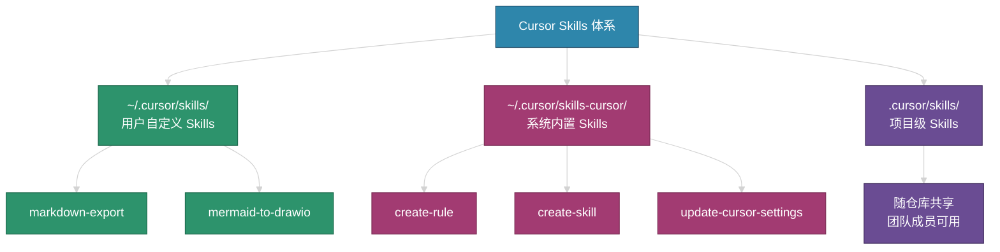
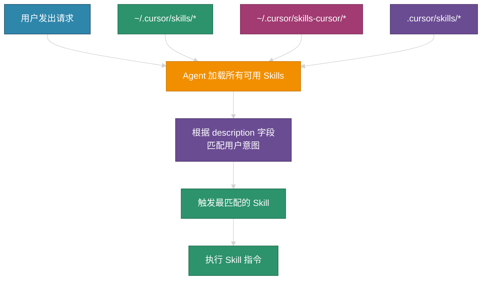
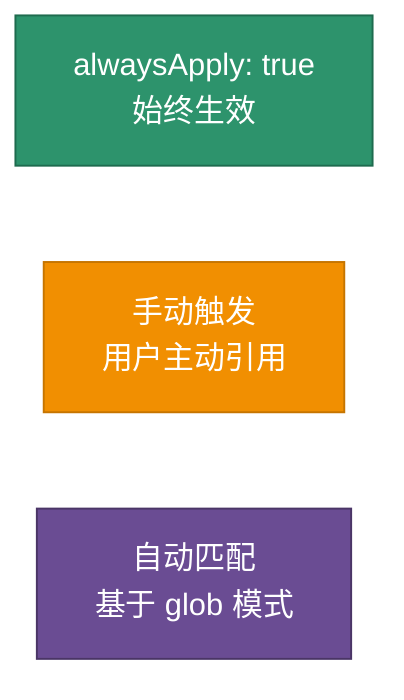

# Cursor Skills 与 Rules 概览

## 1. Skills 列表

当前环境中共有 **5 个** 可用 Skill，分布在两个目录中。

### 1.1 自定义 Skills（`~/.cursor/skills/`）

| # | 名称 | 说明 |
|---|------|------|
| 1 | **markdown-export** | 将回复保存为 markdown 文件时的格式与内容规范，包括文件命名、Mermaid 图表配色、中英文排版等 |
| 2 | **mermaid-to-drawio** | 将 Mermaid 时序图转换为 Draw.io (.drawio) 格式，包含配色、箭头、生命线等样式规范 |

### 1.2 内置 Skills（`~/.cursor/skills-cursor/`）

| # | 名称 | 说明 |
|---|------|------|
| 3 | **create-rule** | 创建 Cursor Rules，用于持久化的 AI 编码指导规范 |
| 4 | **create-skill** | 指导用户创建新的 Agent Skills，包括技能结构和最佳实践 |
| 5 | **update-cursor-settings** | 修改 Cursor / VSCode 的 `settings.json` 用户设置 |

> **注意**：`~/.cursor/skills-cursor/` 目录下实际还存在 `create-subagent` 和 `migrate-to-skills` 两个目录，但它们未出现在当前 Agent 的可用 Skills 列表中。

---

## 2. Rules 列表

当前环境中仅有 **1 条** Cursor Rule。

| # | 名称 | 路径 | 类型 | 内容 |
|---|------|------|------|------|
| 1 | **chinese-response** | `~/.cursor/rules/chinese-response.mdc` | `alwaysApply: true`（始终生效） | 始终使用中文（简体）进行回答；思考过程也必须使用中文显示 |

未发现任何 `AGENTS.md` 文件。

---

## 3. Skills 目录结构与定位

### 3.1 两个目录的关系



### 3.2 三种存储位置对比

| 位置 | 性质 | 作用域 | 可否手动创建 |
|------|------|--------|------------|
| `~/.cursor/skills/skill-name/` | 用户自定义（个人级） | 跨所有项目生效 | 可以 |
| `.cursor/skills/skill-name/`（项目根目录） | 用户自定义（项目级） | 仅当前项目，随仓库共享 | 可以 |
| `~/.cursor/skills-cursor/skill-name/` | 系统内置 | 跨所有项目生效 | **禁止** |

### 3.3 优先级与触发机制

两个目录之间**没有严格的优先级覆盖机制**，它们的工作方式如下：



核心要点：

- **平等共存**：所有目录中的 Skills 被同时加载到可用列表中
- **按需匹配**：Agent 根据每个 Skill 的 `description` 字段与用户意图的匹配程度来决定触发哪个
- **非覆盖关系**：不存在"自定义 Skill 覆盖内置 Skill"的机制
- **分工明确**：`~/.cursor/skills/` 给用户用，`~/.cursor/skills-cursor/` 给系统用，互不干扰

### 3.4 Skill 文件结构

每个 Skill 是一个目录，核心文件为 `SKILL.md`：

```
skill-name/
├── SKILL.md              # 必需 - 主指令文件
├── reference.md          # 可选 - 详细参考文档
├── examples.md           # 可选 - 使用示例
└── scripts/              # 可选 - 工具脚本
    ├── validate.py
    └── helper.sh
```

`SKILL.md` 必须包含 YAML frontmatter：

```yaml
---
name: your-skill-name        # 最多 64 字符，仅小写字母/数字/连字符
description: 简要描述及触发场景  # 最多 1024 字符
---
```

---

## 4. Rules 文件结构

### 4.1 存储位置

| 位置 | 作用域 |
|------|--------|
| `~/.cursor/rules/*.mdc` | 全局规则，跨项目生效 |
| `.cursor/rules/*.mdc`（项目根目录） | 项目级规则 |
| `AGENTS.md`（任意目录） | 目录级规则 |

### 4.2 规则类型



当前唯一的规则 `chinese-response.mdc` 类型为 `alwaysApply: true`，意味着它在每次对话中都会自动生效，无需手动触发。
