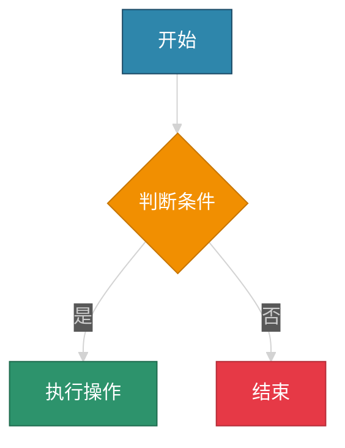
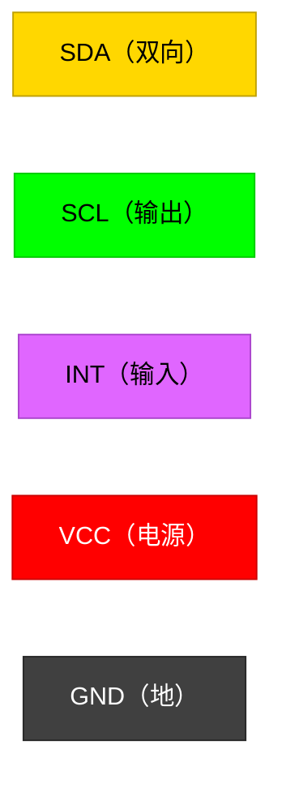

# Markdown 文档导出规范

当用户要求将回复保存为 markdown 文件时，必须遵循以下所有规则。

---

## 1. 文件命名

- 文件名必须使用**英文**，全小写，单词之间用连字符 `-` 分隔。
- 例如：`rk3588-device-tree-guide.md`、`touch-driver-debug-flow.md`

## 2. 内容要求

- 内容必须**详实丰富，不厌其烦**，深入展开每个知识点。
- 必须包含丰富的图表来辅助说明，包括但不限于：
  - 流程图（Flowchart）
  - 关系图（Class Diagram / ER Diagram）
  - 时序图（Sequence Diagram）
  - 框图（Block Diagram）
  - 状态图（State Diagram）
  - 甘特图（Gantt Chart，适用时）

## 3. 图表语法

- 所有图表必须使用 **Mermaid** 语法绘制。
- 尽量不要使用外部图片链接或 ASCII 艺术图。
- **禁止使用 `\n` 作为换行**：Mermaid 节点文本中需要换行时，必须使用 ` ` 标签，不要使用 `\n`。`\n` 在预览中会被原样显示为文字，不会换行。
  - 正确示例：`A["第一行 第二行"]`
  - 错误示例：`A["第一行\n第二行"]`

## 4. Mermaid 配色方案

所有 Mermaid 图表必须使用**深彩色配色方案**，以适合在暗色主题环境中查看，同时保持良好的对比度和可读性。

在每个 Mermaid 图表的开头添加 `%%{init: {'theme': 'dark'}}%%` 或使用 `style` 语句自定义节点颜色。推荐配色：

- 主节点：`fill:#2E86AB,stroke:#1B4965,color:#FFFFFF`
- 次要节点：`fill:#A23B72,stroke:#7B2D55,color:#FFFFFF`
- 决策节点：`fill:#F18F01,stroke:#C67500,color:#FFFFFF`
- 成功/完成：`fill:#2D936C,stroke:#1E6B4E,color:#FFFFFF`
- 错误/失败：`fill:#E63946,stroke:#B52D38,color:#FFFFFF`
- 信息节点：`fill:#6A4C93,stroke:#4A3566,color:#FFFFFF`

示例：

## 5. 中英文排版

- 英文和中文之间**必须**有空格分隔。
- 正确示例：`使用 Mermaid 语法绘制 Flowchart 流程图`
- 错误示例：`使用Mermaid语法绘制Flowchart流程图`

## 6. 实时保存

- 在生成 markdown 内容的过程中，**必须随时保存**到文件。
- 避免因为会话超时导致新增内容丢失。
- 建议策略：
  - 每完成一个大章节就保存一次。
  - 如果内容很长，分多次追加写入。
  - 宁可多保存几次，也不要等到最后一次性写入。

## 7. 引脚颜色标记

当涉及到通信引脚时，**必须**用颜色标记引脚方向。使用以下固定配色：

| 引脚类型 | 颜色 | 色值 |
|---------|------|------|
| 输入（Input） | 亮紫色 | `#E066FF` |
| 输出（Output） | 绿色 | `#00FF00` |
| 双向（Bidirectional） | 黄色 | `#FFD700` |
| 电源（Power） | 红色 | `#FF0000` |
| 地（Ground） | 亮黑色 | `#404040` |

在 Mermaid 图中的引脚标记示例：

在文本描述中，使用如下格式标注引脚方向：
- `SDA` — 🟡 双向（Bidirectional）
- `SCL` — 🟢 输出（Output）
- `INT` — 🟣 输入（Input）
- `VCC` — 🔴 电源（Power）
- `GND` — ⚫ 地（Ground）
