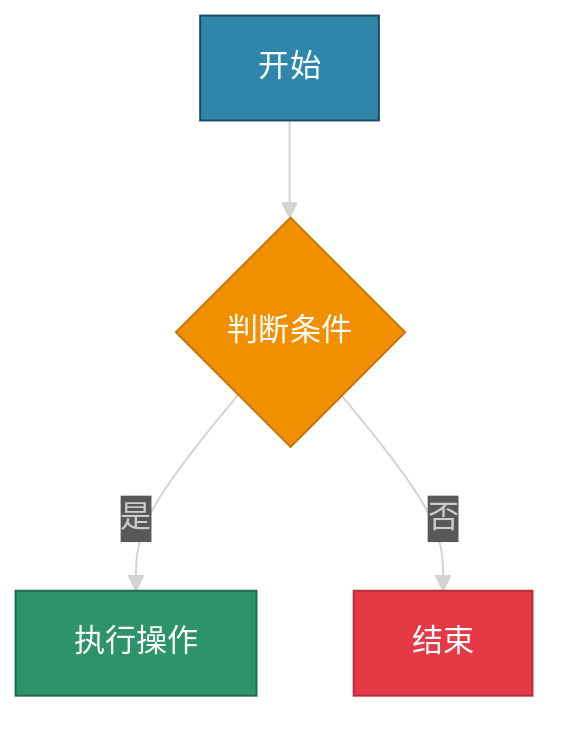
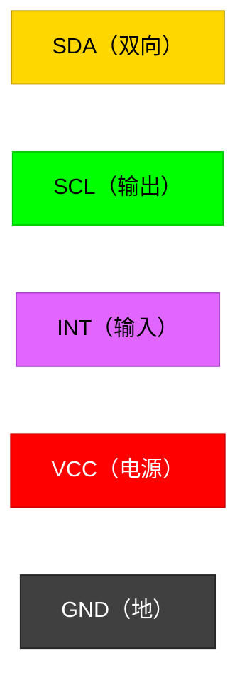

# Markdown 文档导出规范


## 目录 • Markdown 文档导出规范

- <a id="toc-pos-1-文件命名"></a>[1. 文件命名](#1-文件命名)
- <a id="toc-pos-2-内容要求"></a>[2. 内容要求](#2-内容要求)
- <a id="toc-pos-3-图表语法"></a>[3. 图表语法](#3-图表语法)
- <a id="toc-pos-4-图表密度控制"></a>[4. 图表密度控制](#4-图表密度控制)
- <a id="toc-pos-5-mermaid-配色方案"></a>[5. Mermaid 配色方案](#5-mermaid-配色方案)
  - [5.1 硬规则（写图时再读三遍）](#51-硬规则写图时再读三遍)
  - [5.2 禁止提交的形态](#52-禁止提交的形态)
  - [5.3 推荐节点色板（深彩色）](#53-推荐节点色板深彩色)
  - [5.4 合格示例](#54-合格示例)
  - [5.5 借口对照（这些想法出现时：停下来补色）](#55-借口对照这些想法出现时停下来补色)
  - [5.6 红旗 — 写出图后立刻自检](#56-红旗--写出图后立刻自检)
- <a id="toc-pos-6-中英文排版"></a>[6. 中英文排版](#6-中英文排版)
- <a id="toc-pos-7-实时保存"></a>[7. 实时保存](#7-实时保存)
- <a id="toc-pos-8-引脚颜色标记"></a>[8. 引脚颜色标记](#8-引脚颜色标记)

---

当用户要求**生成、撰写、保存或导出** markdown 文档时（不限于「保存/导出」字样），必须遵循以下所有规则。对话里直接给出的 Mermaid 图同样适用。

**铁律（写每一张图之前先读三遍，缺一不可）：**

1. 所有的 Mermaid 图表都使用深彩色配色方案，以便适合在暗色主题环境中查看，同时保持良好的对比度和可读性。
2. 所有的 Mermaid 图表都使用深彩色配色方案，以便适合在暗色主题环境中查看，同时保持良好的对比度和可读性。
3. 所有的 Mermaid 图表都使用深彩色配色方案，以便适合在暗色主题环境中查看，同时保持良好的对比度和可读性。

没有「简单图可以跳过」「先出草稿再上色」「theme:dark 已经够了」的例外。详见 §5。

工作区根存在 `ai.cursor/` 目录时，**REQUIRED：** 先读并遵循 **`ai-cursor-doc-output`** 决定目录；本文件约束 basename、正文格式，以及**每一张 Mermaid 的深彩色配色**。

---

## 1. 文件命名 <a id="1-文件命名"></a> <a href="#toc-pos-1-文件命名" class="md-toc-back" style="float:right;text-decoration:none;color:#5c6370"><svg xmlns="http://www.w3.org/2000/svg" width="10.5pt" height="10.5pt" viewBox="0 0 24 24" fill="none" stroke="currentColor" stroke-width="2" stroke-linecap="round" stroke-linejoin="round" style="vertical-align:-0.15em" aria-hidden="true"><path d="M9 14 4 9l5-5"/><path d="M20 20v-7a4 4 0 0 0-4-4H4"/></svg></a>

- 文件名必须使用**英文**，全小写，单词之间用连字符 `-` 分隔。
- 例如：`rk3588-device-tree-guide.md`、`touch-driver-debug-flow.md`
- 目录：若适用 **`ai-cursor-doc-output`**，不要写到仓库根或 `docs/`

## 2. 内容要求 <a id="2-内容要求"></a> <a href="#toc-pos-2-内容要求" class="md-toc-back" style="float:right;text-decoration:none;color:#5c6370"><svg xmlns="http://www.w3.org/2000/svg" width="10.5pt" height="10.5pt" viewBox="0 0 24 24" fill="none" stroke="currentColor" stroke-width="2" stroke-linecap="round" stroke-linejoin="round" style="vertical-align:-0.15em" aria-hidden="true"><path d="M9 14 4 9l5-5"/><path d="M20 20v-7a4 4 0 0 0-4-4H4"/></svg></a>

- 内容必须**详实丰富，不厌其烦**，深入展开每个知识点。
- 必须包含丰富的图表来辅助说明，包括但不限于：
  - 流程图（Flowchart）
  - 关系图（Class Diagram / ER Diagram）
  - 时序图（Sequence Diagram）
  - 框图（Block Diagram）
  - 状态图（State Diagram）
  - 甘特图（Gantt Chart，适用时）

## 3. 图表语法 <a id="3-图表语法"></a> <a href="#toc-pos-3-图表语法" class="md-toc-back" style="float:right;text-decoration:none;color:#5c6370"><svg xmlns="http://www.w3.org/2000/svg" width="10.5pt" height="10.5pt" viewBox="0 0 24 24" fill="none" stroke="currentColor" stroke-width="2" stroke-linecap="round" stroke-linejoin="round" style="vertical-align:-0.15em" aria-hidden="true"><path d="M9 14 4 9l5-5"/><path d="M20 20v-7a4 4 0 0 0-4-4H4"/></svg></a>

- 所有图表必须使用 **Mermaid** 语法绘制。
- 每一张图都必须遵守 §5 深彩色配色硬规则（`theme: dark` **加上**节点 `style`/`classDef`）。无配色的图视为未完成，不得写入文件。
- 尽量不要使用外部图片链接或 ASCII 艺术图。
- **禁止使用 `\n` 作为换行**：Mermaid 节点文本中需要换行时，必须使用 `<br>` 标签，不要使用 `\n`。`\n` 在预览中会被原样显示为文字，不会换行。
  - 正确示例：`A["第一行<br>第二行"]`
  - 错误示例：`A["第一行\n第二行"]`
- 该规则适用于**所有 Mermaid 文本位置**，包括但不限于：节点标签、边标签、`Note over`/`Note right of` 文本、子图标题等。凡是需要换行，一律使用 `<br>`，禁止使用 `\n`。
- **文字必须完整露出。** 节点、子图标题、边标签在预览里不得被框裁掉、被别的节点盖住或被箭头穿过。长文本用 `<br>` 换行，让框被文字撑开。flowchart 的排法见 `mermaid-flowchart-layout` §11。写完必须看渲染结果；仍被挡就挪开挡住它的节点或边，不要把字号缩小到塞进旧框。

## 4. 图表密度控制 <a id="4-图表密度控制"></a> <a href="#toc-pos-4-图表密度控制" class="md-toc-back" style="float:right;text-decoration:none;color:#5c6370"><svg xmlns="http://www.w3.org/2000/svg" width="10.5pt" height="10.5pt" viewBox="0 0 24 24" fill="none" stroke="currentColor" stroke-width="2" stroke-linecap="round" stroke-linejoin="round" style="vertical-align:-0.15em" aria-hidden="true"><path d="M9 14 4 9l5-5"/><path d="M20 20v-7a4 4 0 0 0-4-4H4"/></svg></a>

当 Mermaid 流程图节点过多、单行排列过于密集时，必须进行拆分以保证可读性。具体规则：

- **对比类图表**（如两种方案并列对比）：禁止将多个子流程塞进同一个 Mermaid 代码块的并列 `subgraph` 中。应拆分为**多个独立的 Mermaid 代码块**，使其自然上下排列，每个代码块前加加粗标题标注。
- **单流程过长**（节点超过 6-7 个）：应将 `flowchart LR` 改为 `flowchart TB`，使流程纵向展开；或将流程在逻辑断点处拆分为两个代码块。
- **判断标准**：如果预览时节点文字被压缩、需要横向滚动、或节点间距过小难以辨识，即说明密度过高，必须拆分。
- **跨域架构图例外**（多层逻辑域、多 subgraph 协作）：优先**单张图** + `flowchart TB` 分层与左右列对齐，避免跨 subgraph 连线穿插；不要仅为「减交叉」拆成多张业务图。详见 skill **`mermaid-flowchart-layout`** §1.4、§3–§6（排版占位线必须隐形、禁止裸 `~~~`；语义 `linkStyle`、箭头说明；**小图不加独立图例**，仅复杂架构图且 ≥3 种线型时才用 §6.3）。

正确做法（拆分为两个代码块，上下排列）：

```markdown
**方案 A**：

​```mermaid
%%{init: {'theme': 'dark'}}%%
flowchart LR
    A1["步骤 1"] --> A2["步骤 2"] --> A3["步骤 3"]
    classDef n fill:#2E86AB,stroke:#1B4965,color:#FFFFFF
    class A1,A2,A3 n
​```

**方案 B**：

​```mermaid
%%{init: {'theme': 'dark'}}%%
flowchart LR
    B1["步骤 1"] --> B2["步骤 2"] --> B3["步骤 3"]
    classDef n fill:#2E86AB,stroke:#1B4965,color:#FFFFFF
    class B1,B2,B3 n
​```
```

错误做法（挤在一个代码块中左右并排）。反例只错在并排，配色仍须深彩色：

```markdown
​```mermaid
%%{init: {'theme': 'dark'}}%%
flowchart TB
    subgraph A["方案 A"]
        A1 --> A2 --> A3
    end
    subgraph B["方案 B"]
        B1 --> B2 --> B3
    end
    classDef n fill:#2E86AB,stroke:#1B4965,color:#FFFFFF
    class A1,A2,A3,B1,B2,B3 n
​```
```

## 5. Mermaid 配色方案 <a id="5-mermaid-配色方案"></a> <a href="#toc-pos-5-mermaid-配色方案" class="md-toc-back" style="float:right;text-decoration:none;color:#5c6370"><svg xmlns="http://www.w3.org/2000/svg" width="10.5pt" height="10.5pt" viewBox="0 0 24 24" fill="none" stroke="currentColor" stroke-width="2" stroke-linecap="round" stroke-linejoin="round" style="vertical-align:-0.15em" aria-hidden="true"><path d="M9 14 4 9l5-5"/><path d="M20 20v-7a4 4 0 0 0-4-4H4"/></svg></a>

### 5.1 硬规则（写图时再读三遍）

所有的 Mermaid 图表都使用深彩色配色方案，以便适合在暗色主题环境中查看，同时保持良好的对比度和可读性。

所有的 Mermaid 图表都使用深彩色配色方案，以便适合在暗色主题环境中查看，同时保持良好的对比度和可读性。

所有的 Mermaid 图表都使用深彩色配色方案，以便适合在暗色主题环境中查看，同时保持良好的对比度和可读性。

**适用范围：** flowchart / sequenceDiagram / classDiagram / erDiagram / stateDiagram / gantt / gitGraph / pie / mindmap / block / C4 / 其它一切 ` ```mermaid ` 围栏。对话回复里的图、写入 `.md` 的图、草稿图、示意图、小决策图——全部适用。

**每张图必须同时做到（缺一即不合格）：**

1. 围栏**第一行**写 `%%{init: {'theme': 'dark'}}%%`（小 flowchart 再加 `flowchart.useMaxWidth:false`，见 **`mermaid-flowchart-layout`** §10）。
2. **每个可见节点**都有 `style` 或 `classDef`：深色/深彩色 `fill`、协调的 `stroke`、浅色文字（默认 `color:#FFFFFF`）。
3. 对比度足够：暗色底上的字必须浅；禁止浅底深字、深底深字、白底黑字。
4. **禁止**只写 `theme: dark` 却不给节点上色——默认节点在暗色预览里往往发灰、发白、发糊，不算完成。

### 5.2 禁止提交的形态

| 禁止 | 原因 |
|------|------|
| 无 `%%{init: {'theme': 'dark'}}%%` | 跟随编辑器/平台默认浅色主题 |
| 只有 `theme: dark`，节点无 `style`/`classDef` | 节点仍是默认浅底或低对比 |
| `fill:#fff` / `#ffffff` / `#eee` / `#f8f8f8` / `#fafafa` / 不写 fill | 浅色图，暗色主题刺眼或看不清 |
| `color:#000` / `#333` 配深色 fill | 字融进色块 |
| 复制本 skill 排版示例时把配色一起省掉 | 排版示例的省略不等于允许无色 |

引脚方向色（亮紫/绿/黄等）按 **§8**，仍须 `theme: dark`，且字色按对比度选黑或白。

### 5.3 推荐节点色板（深彩色）

- 主节点：`fill:#2E86AB,stroke:#1B4965,color:#FFFFFF`
- 次要节点：`fill:#A23B72,stroke:#7B2D55,color:#FFFFFF`
- 决策节点：`fill:#F18F01,stroke:#C67500,color:#FFFFFF`
- 成功/完成：`fill:#2D936C,stroke:#1E6B4E,color:#FFFFFF`
- 错误/失败：`fill:#E63946,stroke:#B52D38,color:#FFFFFF`
- 信息节点：`fill:#6A4C93,stroke:#4A3566,color:#FFFFFF`

节点多时用 `classDef` + `class`，不要只给起止两个节点上色。

架构协作图可用 **`linkStyle`** 区分路径语义（应用 API / 数据面 / 同步 / 背板虚线 / 系统级点线）；连线色见 **`mermaid-flowchart-layout`** §4。时序图按调用方向上色时改用 §4.1：向右请求实线 `#3370FF`，向左返回虚线 `#00A870`，暗色底上的自调用实线 `#E8EAED`。流程图步骤箭头不用这组颜色。**小流程图、边上已有说明、线型不足 3 种时不要附图例**；仅复杂架构图才按 §6.2–§6.3 画独立图例。连线着色**不能代替**节点深彩色。

### 5.4 合格示例


```mermaid
%%{init: {'theme': 'dark'}}%%
flowchart TD
    A[开始] --> B{判断条件}
    B -->|是| C[执行操作]
    B -->|否| D[结束]
    style A fill:#2E86AB,stroke:#1B4965,color:#FFFFFF
    style B fill:#F18F01,stroke:#C67500,color:#FFFFFF
    style C fill:#2D936C,stroke:#1E6B4E,color:#FFFFFF
    style D fill:#E63946,stroke:#B52D38,color:#FFFFFF
```

### 5.5 借口对照（这些想法出现时：停下来补色）

| 借口 | 实际 |
|------|------|
| 「先把结构画对，颜色以后再加」 | 无色图不得写入文件；结构与配色必须同一次完成 |
| 「这张图很简单，默认主题就行」 | 简单图同样在暗色主题里看；越小越要 `style` |
| 「已经写了 `theme: dark`」 | 只完成了一半；节点仍要 `style`/`classDef` |
| 「排版 skill 的示例没写 style」 | 那些示例只管分行/隐形线；正式输出必须按本节补色 |
| 「用户没提配色 / 赶时间」 | 本规则不依赖用户提醒；无色 = 未完成 |
| 「sequenceDiagram / classDiagram 不好上色」 | 仍须 `theme: dark`；能 `style`/`classDef` 的参与者/类必须上色 |
| 「浅色对比度其实也行」 | 禁止。目标是暗色主题环境，不是打印纸 |

### 5.6 红旗 — 写出图后立刻自检

- 围栏里第一行不是 `%%{init: ... theme ... dark ...}`
- 搜不到 `fill:#` 或 `classDef`
- 预览里节点发白、发灰、像默认皮肤
- 暗色背景上字发暗、看不清
- 「我一会儿再统一改配色」

**出现任一条：补色后再保存。不要带着浅色/默认图结束任务。**

## 6. 中英文排版 <a id="6-中英文排版"></a> <a href="#toc-pos-6-中英文排版" class="md-toc-back" style="float:right;text-decoration:none;color:#5c6370"><svg xmlns="http://www.w3.org/2000/svg" width="10.5pt" height="10.5pt" viewBox="0 0 24 24" fill="none" stroke="currentColor" stroke-width="2" stroke-linecap="round" stroke-linejoin="round" style="vertical-align:-0.15em" aria-hidden="true"><path d="M9 14 4 9l5-5"/><path d="M20 20v-7a4 4 0 0 0-4-4H4"/></svg></a>

- 英文和中文之间**必须**有空格分隔。
- 正确示例：`使用 Mermaid 语法绘制 Flowchart 流程图`
- 错误示例：`使用Mermaid语法绘制Flowchart流程图`

## 7. 实时保存 <a id="7-实时保存"></a> <a href="#toc-pos-7-实时保存" class="md-toc-back" style="float:right;text-decoration:none;color:#5c6370"><svg xmlns="http://www.w3.org/2000/svg" width="10.5pt" height="10.5pt" viewBox="0 0 24 24" fill="none" stroke="currentColor" stroke-width="2" stroke-linecap="round" stroke-linejoin="round" style="vertical-align:-0.15em" aria-hidden="true"><path d="M9 14 4 9l5-5"/><path d="M20 20v-7a4 4 0 0 0-4-4H4"/></svg></a>

- 在生成 markdown 内容的过程中，**必须随时保存**到文件。
- 避免因为会话超时导致新增内容丢失。
- **不得把无配色的 Mermaid 当「先占位」写入。** 每次追加的图都必须已满足 §5；不要指望文末再统一上色。
- 建议策略：
  - 每完成一个大章节就保存一次。
  - 如果内容很长，分多次追加写入。
  - 宁可多保存几次，也不要等到最后一次性写入。

## 8. 引脚颜色标记 <a id="8-引脚颜色标记"></a> <a href="#toc-pos-8-引脚颜色标记" class="md-toc-back" style="float:right;text-decoration:none;color:#5c6370"><svg xmlns="http://www.w3.org/2000/svg" width="10.5pt" height="10.5pt" viewBox="0 0 24 24" fill="none" stroke="currentColor" stroke-width="2" stroke-linecap="round" stroke-linejoin="round" style="vertical-align:-0.15em" aria-hidden="true"><path d="M9 14 4 9l5-5"/><path d="M20 20v-7a4 4 0 0 0-4-4H4"/></svg></a>

当涉及到通信引脚时，**必须**用颜色标记引脚方向。使用以下固定配色：

| 引脚类型 | 颜色 | 色值 |
|---------|------|------|
| 输入（Input） | 亮紫色 | `#E066FF` |
| 输出（Output） | 绿色 | `#00FF00` |
| 双向（Bidirectional） | 黄色 | `#FFD700` |
| 电源（Power） | 红色 | `#FF0000` |
| 地（Ground） | 亮黑色 | `#404040` |

在 Mermaid 图中的引脚标记示例：


```mermaid
%%{init: {'theme': 'dark'}}%%
flowchart LR
    SDA["SDA（双向）"]
    SCL["SCL（输出）"]
    INT["INT（输入）"]
    VCC["VCC（电源）"]
    GND["GND（地）"]
    style SDA fill:#FFD700,stroke:#BFA000,color:#000000
    style SCL fill:#00FF00,stroke:#00CC00,color:#000000
    style INT fill:#E066FF,stroke:#AA44CC,color:#000000
    style VCC fill:#FF0000,stroke:#CC0000,color:#FFFFFF
    style GND fill:#404040,stroke:#282828,color:#FFFFFF
```

在文本描述中，使用如下格式标注引脚方向：
- `SDA` — 🟡 双向（Bidirectional）
- `SCL` — 🟢 输出（Output）
- `INT` — 🟣 输入（Input）
- `VCC` — 🔴 电源（Power）
- `GND` — ⚫ 地（Ground）
