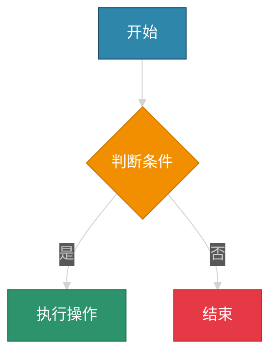
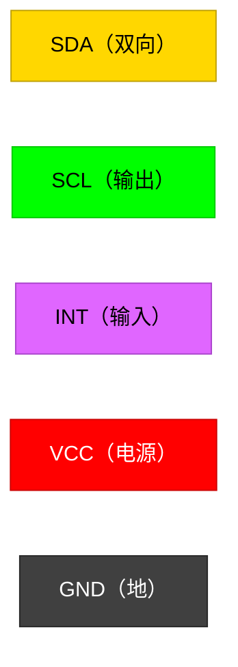

# Markdown 文档导出规范


## 目录 • Markdown 文档导出规范

- <a id="toc-pos-1-文件命名"></a>[1. 文件命名](#1-文件命名)
- <a id="toc-pos-2-内容要求"></a>[2. 内容要求](#2-内容要求)
- <a id="toc-pos-3-图表语法"></a>[3. 图表语法](#3-图表语法)
- <a id="toc-pos-4-图表密度控制"></a>[4. 图表密度控制](#4-图表密度控制)
- <a id="toc-pos-5-mermaid-配色方案"></a>[5. Mermaid 配色方案](#5-mermaid-配色方案)
  - [5.1 硬规则（写图时再读三遍）](#51-硬规则写图时再读三遍)
  - [5.2 禁止提交的形态](#52-禁止提交的形态)
  - [5.3 推荐节点色板（深彩色）](#53-推荐节点色板深彩色)
  - [5.4 合格示例](#54-合格示例)
  - [5.5 借口对照（这些想法出现时：停下来补色）](#55-借口对照这些想法出现时停下来补色)
  - [5.6 红旗 — 写出图后立刻自检](#56-红旗--写出图后立刻自检)
- <a id="toc-pos-6-中英文排版"></a>[6. 中英文排版](#6-中英文排版)
  - [6.1 中英文空格](#61-中英文空格)
  - [6.2 断句标点（落笔即断）](#62-断句标点落笔即断)
  - [6.3 语义直观（落笔即写清）](#63-语义直观落笔即写清)
    - [6.3.1 万能口语动词（语义清晰化）](#631-万能口语动词语义清晰化)
    - [6.3.2 专名标记（直角引号）](#632-专名标记直角引号)
  - [6.4 表格格内（先看列义）](#64-表格格内先看列义)
- <a id="toc-pos-7-实时保存"></a>[7. 实时保存](#7-实时保存)
- <a id="toc-pos-8-引脚颜色标记"></a>[8. 引脚颜色标记](#8-引脚颜色标记)
- <a id="toc-pos-9-表格表头文字颜色"></a>[9. 表格表头文字颜色](#9-表格表头文字颜色)

---

当用户要求**生成、撰写、保存或导出** markdown 文档时（不限于「保存/导出」字样），必须遵循以下所有规则。对话里直接给出的 Mermaid 图同样适用。

**铁律（写每一张图之前先读三遍，缺一不可）：**

1. 所有的 Mermaid 图表都使用深彩色配色方案，以便适合在暗色主题环境中查看，同时保持良好的对比度和可读性。
2. 所有的 Mermaid 图表都使用深彩色配色方案，以便适合在暗色主题环境中查看，同时保持良好的对比度和可读性。
3. 所有的 Mermaid 图表都使用深彩色配色方案，以便适合在暗色主题环境中查看，同时保持良好的对比度和可读性。

没有「简单图可以跳过」「先出草稿再上色」「theme:dark 已经够了」的例外。详见 §5。

工作区根存在 `ai.cursor/` 目录时，**REQUIRED：** 先读并遵循 **`ai-cursor-doc-output`** 决定目录；本文件约束 basename、正文格式，以及**每一张 Mermaid 的深彩色配色**。

---

## 1. 文件命名 <a id="1-文件命名"></a> <a href="#toc-pos-1-文件命名" class="md-toc-back" style="float:right;text-decoration:none;color:#5c6370"><svg xmlns="http://www.w3.org/2000/svg" width="10.5pt" height="10.5pt" viewBox="0 0 24 24" fill="none" stroke="currentColor" stroke-width="2" stroke-linecap="round" stroke-linejoin="round" style="vertical-align:-0.15em" aria-hidden="true"><path d="M9 14 4 9l5-5"/><path d="M20 20v-7a4 4 0 0 0-4-4H4"/></svg></a>

- 文件名必须使用**英文**，全小写，单词之间用连字符 `-` 分隔。
- 例如：`rk3588-device-tree-guide.md`、`touch-driver-debug-flow.md`
- 目录：若适用 **`ai-cursor-doc-output`**，不要写到仓库根或 `docs/`

## 2. 内容要求 <a id="2-内容要求"></a> <a href="#toc-pos-2-内容要求" class="md-toc-back" style="float:right;text-decoration:none;color:#5c6370"><svg xmlns="http://www.w3.org/2000/svg" width="10.5pt" height="10.5pt" viewBox="0 0 24 24" fill="none" stroke="currentColor" stroke-width="2" stroke-linecap="round" stroke-linejoin="round" style="vertical-align:-0.15em" aria-hidden="true"><path d="M9 14 4 9l5-5"/><path d="M20 20v-7a4 4 0 0 0-4-4H4"/></svg></a>

新生成的 markdown 文件，尽量详实丰富，不厌其烦，可以包括各种图，例如流程图、关系图、各种框图等等。当然不是必须都包括这些图，目的是为了清晰明了。

- 内容必须**详实丰富，不厌其烦**，深入展开每个知识点。
- 中文正文必须按 **§6.2 落笔即断句**、**§6.3 落笔即写清语义**、**§6.3.1 不写万能口语动词**、**§6.3.2 专名用「」**、**§6.4 表格先看列义再写格**。首次生成和增补时就把停顿和「谁对谁做什么」写清楚；禁止先写黏连、指代含糊的长句，等人事后补。不要用「打 / 摸 / 直捅」当万能动词。中文专名用直角引号「」，不用英文 “」。表格格内禁止用分号硬挤并列项。分类/是否/状态列用短标签，不要硬写成主谓宾。
- 管道表表头必须按 **§9** 给文字上色（`#C9A0FF` span）；不要为此改成 HTML `<table>`。
- 图是为了把结构、流程、关系讲清楚。适用时用 Mermaid 画，类型按内容选，例如：
  - 流程图（Flowchart）
  - 关系图（Class Diagram / ER Diagram）
  - 时序图（Sequence Diagram）
  - 框图（Block Diagram）
  - 状态图（State Diagram）
  - 甘特图（Gantt Chart，适用时）
- **不要**为凑类型而每种图都画一张；没有对应结构就不要硬画。

## 3. 图表语法 <a id="3-图表语法"></a> <a href="#toc-pos-3-图表语法" class="md-toc-back" style="float:right;text-decoration:none;color:#5c6370"><svg xmlns="http://www.w3.org/2000/svg" width="10.5pt" height="10.5pt" viewBox="0 0 24 24" fill="none" stroke="currentColor" stroke-width="2" stroke-linecap="round" stroke-linejoin="round" style="vertical-align:-0.15em" aria-hidden="true"><path d="M9 14 4 9l5-5"/><path d="M20 20v-7a4 4 0 0 0-4-4H4"/></svg></a>

- 所有图表必须使用 **Mermaid** 语法绘制。
- **HTML 块后面必须空一行再写围栏。** `<table>…</table>`（以及其它 HTML 块）会吃到空行为止；`</table>` 紧挨 `` ```mermaid `` 时，预览把图源当原文吐出（乱码、`{data-source-line=`）。管道表改成 HTML 上色时见 `coloring-markdown-table-column`。
- Markdown 文档中的每个 mermaid 图也要有「实际含义标题」：围栏开头写 YAML `title`（取最近小节 + 图意，禁止「流程图」「如图」），然后再写 `%%{init}`。不要在围栏外再重复一行标题。
- 每一张图都必须遵守 §5 深彩色配色硬规则（`theme: dark` **加上**节点 `style`/`classDef`）。无配色的图视为未完成，不得写入文件。
- 尽量不要使用外部图片链接或 ASCII 艺术图。
- **禁止使用 `\n` 作为换行**：Mermaid 节点文本中需要换行时，必须使用 `<br>` 标签，不要使用 `\n`。`\n` 在预览中会被原样显示为文字，不会换行。
  - 正确示例：`A["第一行<br>第二行"]`
  - 错误示例：`A["第一行\n第二行"]`
- 该规则适用于**所有 Mermaid 文本位置**，包括但不限于：节点标签、边标签、`Note over`/`Note right of` 文本、子图标题等。凡是需要换行，一律使用 `<br>`，禁止使用 `\n`。
- **文字必须完整露出。** 节点、子图标题、边标签在预览里不得被框裁掉、被别的节点盖住或被箭头穿过。长文本用 `<br>` 换行，让框被文字撑开。flowchart 的排法见 `mermaid-flowchart-layout` §11。写完必须看渲染结果；仍被挡就挪开挡住它的节点或边，不要把字号缩小到塞进旧框。

## 4. 图表密度控制 <a id="4-图表密度控制"></a> <a href="#toc-pos-4-图表密度控制" class="md-toc-back" style="float:right;text-decoration:none;color:#5c6370"><svg xmlns="http://www.w3.org/2000/svg" width="10.5pt" height="10.5pt" viewBox="0 0 24 24" fill="none" stroke="currentColor" stroke-width="2" stroke-linecap="round" stroke-linejoin="round" style="vertical-align:-0.15em" aria-hidden="true"><path d="M9 14 4 9l5-5"/><path d="M20 20v-7a4 4 0 0 0-4-4H4"/></svg></a>

当 Mermaid 流程图节点过多、单行排列过于密集时，必须进行拆分以保证可读性。具体规则：

- **对比类图表**（如两种方案并列对比）：禁止将多个子流程塞进同一个 Mermaid 代码块的并列 `subgraph` 中。应拆分为**多个独立的 Mermaid 代码块**，使其自然上下排列，每个代码块前加加粗标题标注。
- **单流程过长**（节点超过 6-7 个）：应将 `flowchart LR` 改为 `flowchart TB`，使流程纵向展开；或将流程在逻辑断点处拆分为两个代码块。
- **判断标准**：如果预览时节点文字被压缩、需要横向滚动、或节点间距过小难以辨识，即说明密度过高，必须拆分。
- **跨域架构图例外**（多层逻辑域、多 subgraph 协作）：优先**单张图** + `flowchart TB` 分层与左右列对齐，避免跨 subgraph 连线穿插；不要仅为「减交叉」拆成多张业务图。详见 skill **`mermaid-flowchart-layout`** §1.4、§3–§6（排版占位线必须隐形、禁止裸 `~~~`；语义 `linkStyle`、箭头说明；**小图不加独立图例**，仅复杂架构图且 ≥3 种线型时才用 §6.3）。

正确做法（拆分为两个代码块，上下排列）：

```markdown
**方案 A**：

​```mermaid
%%{init: {'theme': 'dark'}}%%
flowchart LR
    A1["步骤 1"] --> A2["步骤 2"] --> A3["步骤 3"]
    classDef n fill:#2E86AB,stroke:#1B4965,color:#FFFFFF
    class A1,A2,A3 n
​```

**方案 B**：

​```mermaid
%%{init: {'theme': 'dark'}}%%
flowchart LR
    B1["步骤 1"] --> B2["步骤 2"] --> B3["步骤 3"]
    classDef n fill:#2E86AB,stroke:#1B4965,color:#FFFFFF
    class B1,B2,B3 n
​```
```

错误做法（挤在一个代码块中左右并排）。反例只错在并排，配色仍须深彩色：

```markdown
​```mermaid
%%{init: {'theme': 'dark'}}%%
flowchart TB
    subgraph A["方案 A"]
        A1 --> A2 --> A3
    end
    subgraph B["方案 B"]
        B1 --> B2 --> B3
    end
    classDef n fill:#2E86AB,stroke:#1B4965,color:#FFFFFF
    class A1,A2,A3,B1,B2,B3 n
​```
```

## 5. Mermaid 配色方案 <a id="5-mermaid-配色方案"></a> <a href="#toc-pos-5-mermaid-配色方案" class="md-toc-back" style="float:right;text-decoration:none;color:#5c6370"><svg xmlns="http://www.w3.org/2000/svg" width="10.5pt" height="10.5pt" viewBox="0 0 24 24" fill="none" stroke="currentColor" stroke-width="2" stroke-linecap="round" stroke-linejoin="round" style="vertical-align:-0.15em" aria-hidden="true"><path d="M9 14 4 9l5-5"/><path d="M20 20v-7a4 4 0 0 0-4-4H4"/></svg></a>

### 5.1 硬规则（写图时再读三遍）

所有的 Mermaid 图表都使用深彩色配色方案，以便适合在暗色主题环境中查看，同时保持良好的对比度和可读性。

所有的 Mermaid 图表都使用深彩色配色方案，以便适合在暗色主题环境中查看，同时保持良好的对比度和可读性。

所有的 Mermaid 图表都使用深彩色配色方案，以便适合在暗色主题环境中查看，同时保持良好的对比度和可读性。

**适用范围：** flowchart / sequenceDiagram / classDiagram / erDiagram / stateDiagram / gantt / gitGraph / pie / mindmap / block / C4 / 其它一切 ` ```mermaid ` 围栏。对话回复里的图、写入 `.md` 的图、草稿图、示意图、小决策图——全部适用。

**每张图必须同时做到（缺一即不合格）：**

1. 围栏**第一行**写 `%%{init: {'theme': 'dark'}}%%`（小 flowchart 再加 `flowchart.useMaxWidth:false`，见 **`mermaid-flowchart-layout`** §10）。
2. **每个可见节点**都有 `style` 或 `classDef`：深色/深彩色 `fill`、协调的 `stroke`、浅色文字（默认 `color:#FFFFFF`）。
3. 对比度足够：暗色底上的字必须浅；禁止浅底深字、深底深字、白底黑字。
4. **禁止**只写 `theme: dark` 却不给节点上色——默认节点在暗色预览里往往发灰、发白、发糊，不算完成。
5. 嵌套 `subgraph`：外框与内框 `fill` **不得相同**（外深内浅）。细则见 **`mermaid-flowchart-layout`** §0.1。

### 5.2 禁止提交的形态

| <span style="color:#C9A0FF">禁止</span> | <span style="color:#C9A0FF">原因</span> |
|------|------|
| 无 `%%{init: {'theme': 'dark'}}%%` | 跟随编辑器/平台默认浅色主题 |
| 只有 `theme: dark`，节点无 `style`/`classDef` | 节点仍是默认浅底或低对比 |
| `fill:#fff` / `#ffffff` / `#eee` / `#f8f8f8` / `#fafafa` / 不写 fill | 浅色图，暗色主题刺眼或看不清 |
| `color:#000` / `#333` 配深色 fill | 字融进色块 |
| 复制本 skill 排版示例时把配色一起省掉 | 排版示例的省略不等于允许无色 |
| 嵌套 subgraph 外框与内框同一 `fill` | 套盒糊成一块，分不出层/列 |

引脚方向色（亮紫/绿/黄等）按 **§8**，仍须 `theme: dark`，且字色按对比度选黑或白。

### 5.3 推荐节点色板（深彩色）

- 主节点：`fill:#2E86AB,stroke:#1B4965,color:#FFFFFF`
- 次要节点：`fill:#A23B72,stroke:#7B2D55,color:#FFFFFF`
- 决策节点：`fill:#F18F01,stroke:#C67500,color:#FFFFFF`
- 成功/完成：`fill:#2D936C,stroke:#1E6B4E,color:#FFFFFF`
- 错误/失败：`fill:#E63946,stroke:#B52D38,color:#FFFFFF`
- 信息节点：`fill:#6A4C93,stroke:#4A3566,color:#FFFFFF`

节点多时用 `classDef` + `class`，不要只给起止两个节点上色。

架构协作图可用 **`linkStyle`** 区分路径语义（应用 API / 数据面 / 同步 / 背板虚线 / 系统级点线）；连线色见 **`mermaid-flowchart-layout`** §4。时序图按调用方向上色时改用 §4.1：向右请求实线 `#3370FF`，向左返回虚线 `#00A870`，暗色底上的自调用实线 `#E8EAED`。流程图步骤箭头不用这组颜色。**小流程图、边上已有说明、线型不足 3 种时不要附图例**；仅复杂架构图才按 §6.2–§6.3 画独立图例。连线着色**不能代替**节点深彩色。

### 5.4 合格示例


```mermaid
%%{init: {'theme': 'dark'}}%%
flowchart TD
    A[开始] --> B{判断条件}
    B -->|是| C[执行操作]
    B -->|否| D[结束]
    style A fill:#2E86AB,stroke:#1B4965,color:#FFFFFF
    style B fill:#F18F01,stroke:#C67500,color:#FFFFFF
    style C fill:#2D936C,stroke:#1E6B4E,color:#FFFFFF
    style D fill:#E63946,stroke:#B52D38,color:#FFFFFF
```

### 5.5 借口对照（这些想法出现时：停下来补色）

| <span style="color:#C9A0FF">借口</span> | <span style="color:#C9A0FF">实际</span> |
|------|------|
| 「先把结构画对，颜色以后再加」 | 无色图不得写入文件；结构与配色必须同一次完成 |
| 「这张图很简单，默认主题就行」 | 简单图同样在暗色主题里看；越小越要 `style` |
| 「已经写了 `theme: dark`」 | 只完成了一半；节点仍要 `style`/`classDef` |
| 「排版 skill 的示例没写 style」 | 那些示例只管分行/隐形线；正式输出必须按本节补色 |
| 「用户没提配色 / 赶时间」 | 本规则不依赖用户提醒；无色 = 未完成 |
| 「sequenceDiagram / classDiagram 不好上色」 | 仍须 `theme: dark`；能 `style`/`classDef` 的参与者/类必须上色 |
| 「浅色对比度其实也行」 | 禁止。目标是暗色主题环境，不是打印纸 |
| 「同一层所以内外框同色」 | 同色相可以，同 fill 不行；外深内浅才分得出套盒 |

### 5.6 红旗 — 写出图后立刻自检

- 围栏开头没有 YAML `title:`，或标题是「流程图」「如图」
- YAML `title` 之后不是 `%%{init: ... theme ... dark ...}`
- 搜不到 `fill:#` 或 `classDef`
- 预览里节点发白、发灰、像默认皮肤
- 暗色背景上字发暗、看不清
- 「我一会儿再统一改配色」
- 嵌套 subgraph 的 `style` 外框与内框 `fill` 相同，或预览里层框/列框分不开

**出现任一条：补色后再保存。不要带着浅色/默认图结束任务。**

## 6. 中英文排版 <a id="6-中英文排版"></a> <a href="#toc-pos-6-中英文排版" class="md-toc-back" style="float:right;text-decoration:none;color:#5c6370"><svg xmlns="http://www.w3.org/2000/svg" width="10.5pt" height="10.5pt" viewBox="0 0 24 24" fill="none" stroke="currentColor" stroke-width="2" stroke-linecap="round" stroke-linejoin="round" style="vertical-align:-0.15em" aria-hidden="true"><path d="M9 14 4 9l5-5"/><path d="M20 20v-7a4 4 0 0 0-4-4H4"/></svg></a>

撰写、**首次生成**、**增补**、润色中文 Markdown 正文时都遵守本节。§6.2、§6.3 是落笔规则，不是等人来补的修补清单。

### 6.1 中英文空格

- 英文和中文之间**必须**有空格分隔。
- 正确示例：`使用 Mermaid 语法绘制 Flowchart 流程图`
- 错误示例：`使用Mermaid语法绘制Flowchart流程图`

### 6.2 断句标点（落笔即断）

**默认：第一次写下这句时就要断清楚。** 首次生成 `.md`、往已有文档增补段落/表格/列表时，两套主语、并列路径、条件状语、对照分工，当场用逗号、顿号、分号、冒号标停顿。等用户说「加标点」再回头补 = 正文未完成。

用户事后只要标点、不要改写时：对已有句子**只加标点，不改词、不改语序、不拆成新句**（除非缺句号且本就是两句）、不改标题、不动代码块 / Mermaid。已经停顿清楚的句子不要为改而改。用户要「拆成多行 / 子行缩进 / 符号前缀 / 改成列表」时，走 §6.3，不是本条。

一口气读完会歧义、两套主语黏在一起、或并列项挤成一串时，必须断：

| <span style="color:#C9A0FF">情形</span> | <span style="color:#C9A0FF">加什么</span> | <span style="color:#C9A0FF">例</span> |
|------|------|------|
| 并列路径、设备名、相对名中间只有空格 | 顿号 | `` `\bar_*` `\mem` `\event` `` → `` `\bar_*`、`\mem`、`\event` `` |
| 两套主语 / 两件独立事实黏在一句里 | 分号 | 「内核会把第二条当 bypass，用户态仍把 BAR1 当引擎」→ 中间改分号 |
| 对照、分工、不是 A 而是 B | 分号 | 「ioctl 交页表，MMIO 才写引擎寄存器」→ 「ioctl 交页表；MMIO 才写引擎寄存器」 |
| 时间、条件状语后面直接接主句 | 逗号 | 「开卡时会拿…」→ 「开卡时，会拿…」；「只有一扇 BAR 时引擎在 BAR0」→ 「只有一扇 BAR 时，引擎在 BAR0」 |
| 动宾结构被顿号误当成名词并列 | 逗号 | 「改调度改 `xdma_api.cpp`」→ 「改调度，改 `xdma_api.cpp`」；「填描述符、往 BAR 写 RUN」→ 「填描述符，往 BAR 写 RUN」 |
| 「A、且 B」连接的是条件而不是两项名词 | 逗号 | 「在 **2 个或 3 个 BAR**、且配置 BAR 能被认出来时」→ 顿号改逗号 |
| 冒号后的原因、步骤是多条并列事实 | 分号隔开各条 | 「仍可能变号：没训练上、BIOS 改了、多了一张卡」→ 各条用分号 |
| 插入语、补说「再…」 | 逗号 | 「拿到基路径后再拼」→ 「拿到基路径后，再拼」；「写寄存器的同时再 `write(h2c)`」→ 「的同时，再」 |

**不要动：**

- 代码围栏、Mermaid、命令、标识符内部
- 章节标题（避免无故改目录锚点）
- 已有分号/逗号已经把层次分开的句子
- 用户只要标点时，不要借「更通顺」去改写、删词、调序已有句子

**借口对照：**

| <span style="color:#C9A0FF">借口</span> | <span style="color:#C9A0FF">实际</span> |
|------|------|
| 「等用户说加逗号再补」 | 首次生成和增补时就必须断；事后补是失败 |
| 「先把内容写完，标点以后再说」 | 无停顿的黏连长句视为未完成，不得写入 |
| 「句子已经能懂，不必加」 | 两套主语或路径名连读会歧义时必须断 |
| 「加标点等于改写，不如重写整句」 | 用户只要断句时禁止改措辞；新写时用标点断，不要为断句去改事实 |
| 「表格单元格太短，不加」 | 单元格里同样适用；并列名仍加顿号。多项独立事实不要用分号硬挤，走 **§6.4** 用 `<br>` 分行。解释/对照行要主谓宾；分类/是否列保持短标签 |
| 「顺手把标题/目录也润色一下」 | 未改 `##`～`###` 则不要动目录 |

**红旗 — 写出段落后立刻自检：**

- 一段里两套主语中间只有逗号或没有停顿
- 多个 `/dev`、`\\bar_*`、相对名之间只有空格
- 「…时」后面直接接另一套动作，没有逗号
- 「先出草稿，标点以后统一加」

**出现任一条：当场补标点再保存。** 知识库 `.md` 若只改标点、标题未变：按 **`markdown-knowledge-maintain`** 跳过目录/索引。

### 6.3 语义直观（落笔即写清）

标点只解决「一口气读不断」。首次生成和增补时，还要把**谁、对谁、做什么、不是什么**写在句子结构上。用户事后只要标点时仍走 §6.2，不要借本条去改写已有措辞。用户要拆成多行、子行缩进或符号前缀时，按本条改结构，保留原措辞。

**先做这五条：**

| <span style="color:#C9A0FF">做法</span> | <span style="color:#C9A0FF">怎么落笔</span> |
|------|------|
| 先结论，再展开 | 节首一句能独立站住的判断；细节、代码、图放后面 |
| 写清施事 | 每句能回答「谁对谁做什么」；少用「这 / 那 / 它」跨句指代；Linux 与 Windows、用户态与内核、窗口与 fd 不要共用一个「它」 |
| 否定写死范围 | 「不是 A，是 B」或「不经过 X，走 Y」；不要让否定对象含糊 |
| 对照用表，步骤用编号，结构用图 | 两项以上对照进表；时间顺序用 1. 2. 3.；空间/归属才画 Mermaid。一段话不要同时做这三件事。对比图上下拆，见 §4 |
| 碰巧与绑定分开写 | 句柄碰巧落在哪个 fd，和功能必须对准哪扇窗口，是两件事；关系不写破，标点再密也会混 |

**句子内部：**

- **一层定语。** 「用户态固定拿已打开的 `bar_file[0]` 当 ioctl 句柄」优于把「碰巧 / 钉页 / 编号 0 / 字符设备」叠进同一个主语。
- **同一概念同一叫法。** 全文统一「产品路径 / 参考路径」「引擎控制 BAR / `bar_reg`」。不要一处 config、一处配置 BAR、一处 mmap 配置窗口，除非紧跟着对照。
- **括号只放次要信息。** 主句读完应已完整；VID、宏名、路径放括号或后句。
- **多层一句改列表。** 一段里叠了两层以上（定义 + 归类 + 跳转），或同一层有三项以上并列事实：拆成多行。导语单独成行，子行用 `-` 或缩进符号前缀。分号只解决一口气读不断，不能代替分行。
- **条件、例外单独成句。** 「仅 1 个 BAR 时…」不要塞进主句中段。

配方（输出必须长这样）：

```markdown
所以关系是：

- MMIO 描述 **地址怎么接到设备**
- PIO 描述 **CPU 是否亲自搬每个字**
- DMA 描述 **引擎是否自己搬主机页**

Lite / `bar_reg` / bypass 三条都是 MMIO：

- Lite 和 `bar_reg` 是寄存器 PIO
- bypass 是 CPU 经 MMIO 访存搬卡上存储
- `fpga_send` 才是 DMA 传输

三条窗口怎么接到 XDMA、何时该走 MMIO、何时该走 DMA，见 §7 和 §9。

卡上 BRAM / DDR 相对主机内存在哪，见 §8。
```

错误形态：同一段用分号把定义、归类、见某节全部串完。用户已确认拆行更清晰时，当场改结构，不要只加分号。

**不要用的「清晰」：** 为通顺而改事实；同义反复换叫法；每句都加「注意」；把所有例外堆进一个超长括号；「分号已经把层次分开了」仍把多层挤在一段；用「打 / 摸 / 直捅」当万能动词显得像行话。

**红旗：** 节首没有可独立引用的结论；一句里指代漂到另一侧 OS / 另一扇 BAR；「不是 X」却读不出「是 Y」；对照、步骤、结构挤在同一段；一段里定义、归类、见某节只用分号不分行；表、图注或 Mermaid 标题里出现「打完成中断」「打用户 Slave」「摸 BAR」「直捅」。

**出现任一条：当场改结构再保存。** 万能口语动词对照见 **§6.3.1**。图题说判断、不说类型，见 §3；对比类图禁止左右并排，见 §4。管道表格头字色见 §9；**格内怎么按列义写（短标签 vs 完整句），见 §6.4。**

#### 6.3.1 万能口语动词（语义清晰化）

这是措辞约束，不改硬件事实、不改分层结论。同一字跨层含义不同时，读者会停下来问「这个字是什么意思」。落笔时写成完整主谓宾，让人直接读出谁对谁做了什么。

正文、表格、图注、Mermaid 的 YAML `title` 和节点文字都适用。

| <span style="color:#C9A0FF">不要</span> | <span style="color:#C9A0FF">要</span> | <span style="color:#C9A0FF">适用</span> |
|------|------|------|
| 打中断、打到主机 | 发出中断、投递到主机 | 中断源经 PCIe 到主机 |
| Lite Master 打 Slave、poke 打到谁 | 发起读写、落到谁 | AXI / BAR 通路 |
| 打 TLAST | 置 TLAST | Stream 帧标志 |
| 摸 BAR、摸页、摸存储 | 访问 | MMIO / DMA / 卡上地址 |
| 直捅 | 直接访问 | bypass，绕开引擎 |

**不要改这些「打」：** 「打开」设备或节点、「打印」日志、「打点」调试计数。

用户问某一句、再说「一并改掉」时：同一专题目录里同类口语一起换，不要只改圈出的那一句而图注仍写「打」。

**借口对照：**

| <span style="color:#C9A0FF">借口</span> | <span style="color:#C9A0FF">实际</span> |
|------|------|
| 「打更短，是行话」 | 同一字在中断层和总线层不是同一动作 |
| 「只改用户圈出的那一句」 | 同篇图注仍写打，读者继续问 |
| 「打开也要改成访问」 | 「打开」是 open；本表不管它 |

**出现任一条：当场按上表改措辞再保存。** 不增技术结论。专名怎么加引号见 **§6.3.2**。

#### 6.3.2 专名标记（直角引号）

中文（或中英混写）的概念名，读者可能当成普通动宾或普通名词时，用直角引号 **「」** 标成专名。不用英文 “”。

**何时加：** 该篇结论句、定义表、以及第一次把这个短语当名字用时。后文同一专名不必句句加。对照表左列若是「听到的名字」，也可以加。

| <span style="color:#C9A0FF">要加「」</span> | <span style="color:#C9A0FF">不加</span> |
|------|------|
| 「通道完成中断」「user IRQ」 | 反引号标识符：`fpga_send`、`bar_reg` |
| 「产品路径」「参考路径」「模型 A」 | 拉丁协议名本身：AXI-Stream、MSI-X（不会被读成汉语动宾） |
| 「引擎 CSR」「DMA Bypass」「五张门」 | 章节标题（避免无故改目录锚点） |
| 「主机页」「卡上」「片上」 | 「打开」设备、「打印」日志 |

配方：`XDMA IP 用 MSI / MSI-X 向主机投递「通道完成中断」。`

**不要：** 每个 AXI / BAR / DMA 都套「」；英文引号 “通道完成中断”；标题行里加「」。

**借口对照：**

| <span style="color:#C9A0FF">借口</span> | <span style="color:#C9A0FF">实际</span> |
|------|------|
| 「加粗已经够了」 | 加粗是强调；「」标的是这是一个名字 |
| 「后文也一律加，才算规范」 | 句句加引号会吵；首次和易混处加即可 |
| 「AXI-Stream 也是专名，必须加」 | 拉丁专名不会被读成「流一下」；中文动宾才必须标 |

**出现任一条：当场按本条改专名标记再保存。**

### 6.4 表格格内（先看列义）

**一句话：不是每格都必须主谓宾。** 分类、是否、状态列用短标签（可着色）；解释、对照、提要列才分行写完整句。

撰写、首次生成、增补、润色管道表或 HTML 表时遵守本节。只改格内标点、未改标题时，知识库 `.md` 按 **`markdown-knowledge-maintain`** 跳过目录。

**先看这一列在区分什么，再决定写法：**

| <span style="color:#C9A0FF">列义</span> | <span style="color:#C9A0FF">做法</span> | <span style="color:#C9A0FF">反例</span> |
|------|------|------|
| 分类 / 是否 / 状态 / 短标签（如「是否共用同一份源码」） | 格内只写短词：是、否、声明共用 / 实现不共用。对立语义用字色区分，见 **`coloring-markdown-table-column`** | 扩成「Windows 与 Linux 内核驱动不共用同一份源码」 |
| 一层里并列物件（如四层组成） | 一行一项；每行写出谁干了什么 | 用分号串成一句 |
| 成对对照（如听 X、实际是 Y） | 一句一行、说完再换行；每行主谓宾齐全 | 拆成没有句号的残片；有的行拆、有的不拆 |

**格内不要用分号硬挤。** 解释列里并列的几件事用 `<br>` 分行。分号只留在正文段落里断句（§6.2），不能代替表格结构。标准 Markdown 单元格内不能直接换行，用 HTML `<br>`。

对照已经在左右两列里完成时，右列（解释列）不要再拆成无主语短语。

**解释 / 对照 / 提要格：主谓宾齐全。** 读这一行要能回答：谁、干了什么、落到谁。左列已有名字时，右列仍要写出主语，格子要能单独读。

| <span style="color:#C9A0FF">不要</span> | <span style="color:#C9A0FF">要</span> |
|------|------|
| 不是。 | AXI-Stream 和 AXI-Lite 不是同一条通路。 |
| 前者 / 后者 | AXI-MM DMA 走引擎搬主机页。 |
| 三层问题： | MMIO 描述地址怎么接到设备。 |
| 用户 Slave | 这条窗接到用户 Slave。 |
| `fpga_wr_lite`（单独一格当说明） | 应用调 `fpga_wr_lite`。 |
| IP 用 MSI 打完成中断 | XDMA IP 用 MSI / MSI-X 向主机投递「通道完成中断」。 |
| Lite Master 打用户 Slave | Lite Master 向用户 Slave 发起读写。 |

**分类 / 是否 / 状态格：禁止扩成主谓宾。** 列名已经问完「是否 / 哪一类」，格内重复主语只会挡扫读。一格含两类语义时拆成两个短标签并分别着色，不要合成一句。

| <span style="color:#C9A0FF">不要</span> | <span style="color:#C9A0FF">要</span> |
|------|------|
| Windows 与 Linux 不共用内核驱动源码。 | **否**（橙） |
| 用户态引擎在两边共用同一份 `xdma_api.cpp`。 | **是**（绿） |
| 声明写在同一头文件，实现各写一份。 | **声明共用**（绿）、**实现不共用**（橙） |

**标识符列保留原名。** 偏移、宏、API 名不改。若该列本身是「叫什么」，不要补「谁调」；若该列是「干什么」，旁边再补动作：「软件写 `REG_…`」「应用调 `fpga_send`」。

**索引两列分工不动**（见 **`designated-knowledge-index`**）：

- **说明**：短标签，不改成整句
- **提要 / 读它回答什么**：一句一义，用 `<br>`，也要主谓宾齐全

**不改事实。** 该短则短、该补主语则补主语、该分行则分行。不增技术结论，不把正文段落里的分号整篇清掉。

**借口对照：**

| <span style="color:#C9A0FF">借口</span> | <span style="color:#C9A0FF">实际</span> |
|------|------|
| 「分号已经把层次分开了」 | 解释列多项并列必须 `<br>`；分号只给正文段落 |
| 「对照表右列拆成短语更短」 | 解释列残句读起来怪；一句一行、说完 |
| 「左列已经有主语，右列可省略」 | 解释格要能单独读；分类格本来就该短 |
| 「API 名一格就够」 | 标识符列保留原名；动作列才补「谁调 / 谁写 / 谁管」 |
| 「索引说明也改成整句」 | 说明保持短标签；提要才写完整句 |
| 「§6.4 说了每格主谓宾，是/否也要写成整句」 | 只约束解释/对照/提要列；是否/状态列用短词+颜色更清晰 |
| 「短标签不够专业」 | 列名已经承担问句；格内重复主谓宾是噪音 |

**红旗：** 把「是 / 否」扩成整句；格内三项并列只用分号；对照表「实际」列是「不是。」加两行无句号残片；解释格离开左列就读不出谁在做事。

**出现任一条：当场按列义改格内结构再保存。**

## 7. 实时保存 <a id="7-实时保存"></a> <a href="#toc-pos-7-实时保存" class="md-toc-back" style="float:right;text-decoration:none;color:#5c6370"><svg xmlns="http://www.w3.org/2000/svg" width="10.5pt" height="10.5pt" viewBox="0 0 24 24" fill="none" stroke="currentColor" stroke-width="2" stroke-linecap="round" stroke-linejoin="round" style="vertical-align:-0.15em" aria-hidden="true"><path d="M9 14 4 9l5-5"/><path d="M20 20v-7a4 4 0 0 0-4-4H4"/></svg></a>

- 在生成 markdown 内容的过程中，**必须随时保存**到文件。
- 避免因为会话超时导致新增内容丢失。
- **不得把无配色的 Mermaid 当「先占位」写入。** 每次追加的图都必须已满足 §5；不要指望文末再统一上色。
- 建议策略：
  - 每完成一个大章节就保存一次。
  - 如果内容很长，分多次追加写入。
  - 宁可多保存几次，也不要等到最后一次性写入。

## 8. 引脚颜色标记 <a id="8-引脚颜色标记"></a> <a href="#toc-pos-8-引脚颜色标记" class="md-toc-back" style="float:right;text-decoration:none;color:#5c6370"><svg xmlns="http://www.w3.org/2000/svg" width="10.5pt" height="10.5pt" viewBox="0 0 24 24" fill="none" stroke="currentColor" stroke-width="2" stroke-linecap="round" stroke-linejoin="round" style="vertical-align:-0.15em" aria-hidden="true"><path d="M9 14 4 9l5-5"/><path d="M20 20v-7a4 4 0 0 0-4-4H4"/></svg></a>

当涉及到通信引脚时，**必须**用颜色标记引脚方向。使用以下固定配色：

| <span style="color:#C9A0FF">引脚类型</span> | <span style="color:#C9A0FF">颜色</span> | <span style="color:#C9A0FF">色值</span> |
|---------|------|------|
| 输入（Input） | 亮紫色 | `#E066FF` |
| 输出（Output） | 绿色 | `#00FF00` |
| 双向（Bidirectional） | 黄色 | `#FFD700` |
| 电源（Power） | 红色 | `#FF0000` |
| 地（Ground） | 亮黑色 | `#404040` |

在 Mermaid 图中的引脚标记示例：


```mermaid
%%{init: {'theme': 'dark'}}%%
flowchart LR
    SDA["SDA（双向）"]
    SCL["SCL（输出）"]
    INT["INT（输入）"]
    VCC["VCC（电源）"]
    GND["GND（地）"]
    style SDA fill:#FFD700,stroke:#BFA000,color:#000000
    style SCL fill:#00FF00,stroke:#00CC00,color:#000000
    style INT fill:#E066FF,stroke:#AA44CC,color:#000000
    style VCC fill:#FF0000,stroke:#CC0000,color:#FFFFFF
    style GND fill:#404040,stroke:#282828,color:#FFFFFF
```

在文本描述中，使用如下格式标注引脚方向：
- `SDA` — 🟡 双向（Bidirectional）
- `SCL` — 🟢 输出（Output）
- `INT` — 🟣 输入（Input）
- `VCC` — 🔴 电源（Power）
- `GND` — ⚫ 地（Ground）

## 9. 表格表头文字颜色 <a id="9-表格表头文字颜色"></a> <a href="#toc-pos-9-表格表头文字颜色" class="md-toc-back" style="float:right;text-decoration:none;color:#5c6370"><svg xmlns="http://www.w3.org/2000/svg" width="10.5pt" height="10.5pt" viewBox="0 0 24 24" fill="none" stroke="currentColor" stroke-width="2" stroke-linecap="round" stroke-linejoin="round" style="vertical-align:-0.15em" aria-hidden="true"><path d="M9 14 4 9l5-5"/><path d="M20 20v-7a4 4 0 0 0-4-4H4"/></svg></a>

写 Markdown **管道表**时，必须给**表头文字**上色，让标题行在暗色预览里和数据行分开。只改字体颜色，不改表头背景。

**写法：** 保留 `| 列 |` 管道表。每个表头单元格用 `<span style="color:#C9A0FF">列名</span>`。不要为了上色把整张表改成 `<table>` HTML，不要默认加 `th` 背景或文档级 `<style>`。

**固定色值：** `#C9A0FF`（浅紫，暗色底可读）。用户当场指定其它字色时以当场为准。

正确：

```markdown
| <span style="color:#C9A0FF">函数</span> | <span style="color:#C9A0FF">作用</span> | <span style="color:#C9A0FF">是否需要参数</span> |
|------|------|--------------|
| `priv_reboot()` | 重启设备 | 否 |
```

错误：

| <span style="color:#C9A0FF">禁止</span> | <span style="color:#C9A0FF">原因</span> |
|------|------|
| 纯 `| 函数 |` 无 span | 表头与数据行同色，标题栏看不出 |
| 整表改成 `<table><th>` 只为上色 | 管道表够用；单元格内 span 即可 |
| 给表头加 `background` 当默认 | 本规则只要字色 |
| 写表时先占位、以后再上色 | 出表即带色 |

**例外（可观察条件）：**

- 目标是**飞书云文档**：走 **`feishu-doc-format`**，不要用 span。
- 用户**明确要求**纯 Markdown、不要 HTML、或只要 GitHub 渲染且不要标签：不加 span。
- 冻结表头 / sticky：走 **`freezing-html-table-headers`**（或 MPE 用 **`freezing-mpe-table-headers`**），与字色是两件事。
- 给**某一列数据**按取值加区分字色：走 **`coloring-markdown-table-column`**。那是数据列，不是表头浅紫；管道表 `span` 在预览里经常无色。

| <span style="color:#C9A0FF">借口</span> | <span style="color:#C9A0FF">实际</span> |
|------|------|
| 「标准 Markdown 不能上色」 | 管道表单元格里可以写 span |
| 「要上色必须改成 HTML 表」 | 不必；只包表头文字 |
| 「GitHub 会剥 style，所以不写」 | 知识库默认给 Cursor / VS Code 预览看；照写 |
| 「小表不用上色」 | 凡管道表表头都上色 |
