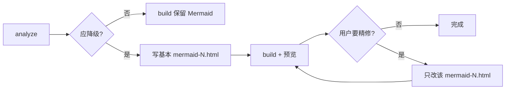

# Markdown 转 HTML 规范


## 目录 • Markdown 转 HTML 规范

- <a id="toc-pos-1-基本结构"></a>[1. 基本结构](#1-基本结构)
- <a id="toc-pos-2-mermaid-图表处理"></a>[2. Mermaid 图表处理](#2-mermaid-图表处理)
  - <a id="toc-pos-21-正常情况"></a>[2.1 正常情况](#21-正常情况)
  - <a id="toc-pos-22-触发降级的条件必须自动判断"></a>[2.2 触发降级的条件（必须自动判断）](#22-触发降级的条件必须自动判断)
- <a id="toc-pos-3-分层彩色卡片布局规范"></a>[3. 分层彩色卡片布局规范](#3-分层彩色卡片布局规范)
  - <a id="toc-pos-31-配色体系深色主题"></a>[3.1 配色体系（深色主题）](#31-配色体系深色主题)
  - <a id="toc-pos-32-层级配色分配"></a>[3.2 层级配色分配](#32-层级配色分配)
  - <a id="toc-pos-33-html-结构模板"></a>[3.3 HTML 结构模板](#33-html-结构模板)
  - <a id="toc-pos-34-css-基础类"></a>[3.4 CSS 基础类](#34-css-基础类)
  - <a id="toc-pos-35-复杂布局扩展"></a>[3.5 复杂布局扩展](#35-复杂布局扩展)
- <a id="toc-pos-4-template-注入机制"></a>[4. `<template>` 注入机制](#4-template-注入机制)
- <a id="toc-pos-5-文件命名"></a>[5. 文件命名](#5-文件命名)
- <a id="toc-pos-6-不要做的事"></a>[6. 不要做的事](#6-不要做的事)
- <a id="toc-pos-7-cli-工具md2html"></a>[7. CLI 工具（md2html）](#7-cli-工具md2html)
  - <a id="toc-pos-71-安装"></a>[7.1 安装](#71-安装)
  - <a id="toc-pos-72-常用命令"></a>[7.2 常用命令](#72-常用命令)
  - <a id="toc-pos-73-sidecar-是什么"></a>[7.3 Sidecar 是什么](#73-sidecar-是什么)
  - <a id="toc-pos-74-sidecar-目录约定"></a>[7.4 Sidecar 目录约定](#74-sidecar-目录约定)
  - <a id="toc-pos-75-两阶段工作流推荐"></a>[7.5 两阶段工作流（推荐）](#75-两阶段工作流推荐)
  - <a id="toc-pos-76-布局模式速查"></a>[7.6 布局模式速查](#76-布局模式速查)
  - <a id="toc-pos-77-命令速查"></a>[7.7 命令速查](#77-命令速查)

---

将 Markdown 文档转换为可在浏览器中独立打开的 HTML 页面，支持 Mermaid 渲染，并在 Mermaid 表达力不足时自动降级为分层彩色卡片布局。

---

## 1. 基本结构 <a id="1-基本结构"></a> <a href="#toc-pos-1-基本结构" class="md-toc-back" style="float:right;text-decoration:none;color:#5c6370"><svg xmlns="http://www.w3.org/2000/svg" width="10.5pt" height="10.5pt" viewBox="0 0 24 24" fill="none" stroke="currentColor" stroke-width="2" stroke-linecap="round" stroke-linejoin="round" style="vertical-align:-0.15em" aria-hidden="true"><path d="M9 14 4 9l5-5"/><path d="M20 20v-7a4 4 0 0 0-4-4H4"/></svg></a>

生成的 HTML 必须是**单文件、零依赖**的独立页面（CDN 引用除外）：

```html
<!DOCTYPE html>
<html lang="zh-CN">
<head>
  <meta charset="UTF-8">
  <meta name="viewport" content="width=device-width,initial-scale=1">
  <title>文档标题</title>
  <script src="https://cdn.jsdelivr.net/npm/marked@12.0.2/marked.min.js"></script>
  <script src="https://cdn.jsdelivr.net/npm/mermaid@10.9.1/dist/mermaid.min.js"></script>
  <style>/* 内嵌全部样式 */</style>
</head>
<body>
  <div id="layout">
    <nav id="sidebar"><!-- 自动生成目录 --></nav>
    <main><article id="content"></article></main>
  </div>
  <script>/* Markdown 解析 + Mermaid 初始化 + TOC 生成 */</script>
</body>
</html>
```

要求：
- 深色主题（GitHub Dark 风格），参考色板见下方"配色体系"
- 左侧固定侧边栏（自动从 h1/h2 生成目录）
- 响应式布局（`@media max-width:900px` 时侧边栏收起）
- Markdown 内容通过 `marked.js` 在客户端解析渲染

## 2. Mermaid 图表处理 <a id="2-mermaid-图表处理"></a> <a href="#toc-pos-2-mermaid-图表处理" class="md-toc-back" style="float:right;text-decoration:none;color:#5c6370"><svg xmlns="http://www.w3.org/2000/svg" width="10.5pt" height="10.5pt" viewBox="0 0 24 24" fill="none" stroke="currentColor" stroke-width="2" stroke-linecap="round" stroke-linejoin="round" style="vertical-align:-0.15em" aria-hidden="true"><path d="M9 14 4 9l5-5"/><path d="M20 20v-7a4 4 0 0 0-4-4H4"/></svg></a>

### 2.1 正常情况 <a id="21-正常情况"></a> <a href="#toc-pos-21-正常情况" class="md-toc-back" style="float:right;text-decoration:none;color:#5c6370"><svg xmlns="http://www.w3.org/2000/svg" width="10.5pt" height="10.5pt" viewBox="0 0 24 24" fill="none" stroke="currentColor" stroke-width="2" stroke-linecap="round" stroke-linejoin="round" style="vertical-align:-0.15em" aria-hidden="true"><path d="M9 14 4 9l5-5"/><path d="M20 20v-7a4 4 0 0 0-4-4H4"/></svg></a>

Markdown 中的 ` ```mermaid ` 代码块由 `mermaid.js` 在客户端渲染，无需特殊处理。

### 2.2 触发降级的条件（必须自动判断） <a id="22-触发降级的条件必须自动判断"></a> <a href="#toc-pos-22-触发降级的条件必须自动判断" class="md-toc-back" style="float:right;text-decoration:none;color:#5c6370"><svg xmlns="http://www.w3.org/2000/svg" width="10.5pt" height="10.5pt" viewBox="0 0 24 24" fill="none" stroke="currentColor" stroke-width="2" stroke-linecap="round" stroke-linejoin="round" style="vertical-align:-0.15em" aria-hidden="true"><path d="M9 14 4 9l5-5"/><path d="M20 20v-7a4 4 0 0 0-4-4H4"/></svg></a>

遇到以下任一情况时，**禁止使用 Mermaid**，必须改用分层彩色卡片布局：

| 信号 | 说明 |
|------|------|
| 节点 > 15 个 | 单个 Mermaid 代码块中节点数超过 15 |
| 层级 > 4 层 | 架构图存在 4 层以上的纵向分层 |
| 并列 subgraph > 3 | 同一层级有 3 个以上并列 subgraph |
| 节点含多行文本 | 节点内需要标题 + 描述 + 注释等多行信息 |
| 双向/复杂连接 | 层间存在大量双向箭头或交叉连接 |
| 表格/列表嵌套 | 节点内需要展示列表或表格形式的子项 |

**判断原则**：如果 Mermaid 渲染后可能出现节点重叠、文字截断、箭头交叉、需要横向滚动，就必须降级。

## 3. 分层彩色卡片布局规范 <a id="3-分层彩色卡片布局规范"></a> <a href="#toc-pos-3-分层彩色卡片布局规范" class="md-toc-back" style="float:right;text-decoration:none;color:#5c6370"><svg xmlns="http://www.w3.org/2000/svg" width="10.5pt" height="10.5pt" viewBox="0 0 24 24" fill="none" stroke="currentColor" stroke-width="2" stroke-linecap="round" stroke-linejoin="round" style="vertical-align:-0.15em" aria-hidden="true"><path d="M9 14 4 9l5-5"/><path d="M20 20v-7a4 4 0 0 0-4-4H4"/></svg></a>

当 Mermaid 不适用时，使用纯 HTML/CSS 绘制分层架构图。

### 3.1 配色体系（深色主题） <a id="31-配色体系深色主题"></a> <a href="#toc-pos-31-配色体系深色主题" class="md-toc-back" style="float:right;text-decoration:none;color:#5c6370"><svg xmlns="http://www.w3.org/2000/svg" width="10.5pt" height="10.5pt" viewBox="0 0 24 24" fill="none" stroke="currentColor" stroke-width="2" stroke-linecap="round" stroke-linejoin="round" style="vertical-align:-0.15em" aria-hidden="true"><path d="M9 14 4 9l5-5"/><path d="M20 20v-7a4 4 0 0 0-4-4H4"/></svg></a>

```css
:root {
  --bg:#0d1117; --panel:#161b22; --panel2:#21262d; --border:#30363d;
  --text:#c9d1d9; --muted:#8b949e; --dim:#484f58;
  --blue:#58a6ff;    --bluebg:#0d2137;    --bluetxt:#79c0ff;
  --green:#3fb950;   --greenbg:#122117;   --greentxt:#7ee787;   --greenborder:#238636;
  --orange:#f0883e;  --orangebg:#1a150d;  --orangetxt:#ffcc80;
  --purple:#a371f7;  --purplebg:#1a1428;  --purpletxt:#d2a8ff;  --purpleborder:#6e40c9;
  --red:#f85149;     --redbg:#2d1215;     --redtxt:#ffa198;     --redborder:#da3633;
}
```

### 3.2 层级配色分配 <a id="32-层级配色分配"></a> <a href="#toc-pos-32-层级配色分配" class="md-toc-back" style="float:right;text-decoration:none;color:#5c6370"><svg xmlns="http://www.w3.org/2000/svg" width="10.5pt" height="10.5pt" viewBox="0 0 24 24" fill="none" stroke="currentColor" stroke-width="2" stroke-linecap="round" stroke-linejoin="round" style="vertical-align:-0.15em" aria-hidden="true"><path d="M9 14 4 9l5-5"/><path d="M20 20v-7a4 4 0 0 0-4-4H4"/></svg></a>

每一层使用不同颜色主题，从上到下推荐：

| 层级 | 语义 | 颜色 | border | 背景 | 文字 |
|------|------|------|--------|------|------|
| 应用层 | 用户态进程 | 灰 | `--dim` | `--panel2` | `--muted` |
| 库/SDK 层 | 链接库 | 蓝 | `--blue` | `--bluebg` | `--bluetxt` |
| 服务层 | Daemon | 橙 | `--orange` | `--orangebg` | `--orangetxt` |
| 内核层 | 驱动/模块 | 紫 | `--purple` | `--purplebg` | `--purpletxt` |
| 硬件层 | FPGA/芯片 | 灰暗 | `--dim` | `--panel` | `--muted` |
| 固件层 | MCU/FW | 橙虚线 | `--orange` dashed | `--orangebg` | `--orangetxt` |
| 管理面 | 监控/告警 | 红 | `--red` | `--redbg` | `--redtxt` |
| 数据面 | 高速数据通路 | 绿 | `--green` | `--greenbg` | `--greentxt` |

如果实际层级语义与上表不匹配，可灵活选择颜色，但必须保持**相邻层颜色有明显区分**。

### 3.3 HTML 结构模板 <a id="33-html-结构模板"></a> <a href="#toc-pos-33-html-结构模板" class="md-toc-back" style="float:right;text-decoration:none;color:#5c6370"><svg xmlns="http://www.w3.org/2000/svg" width="10.5pt" height="10.5pt" viewBox="0 0 24 24" fill="none" stroke="currentColor" stroke-width="2" stroke-linecap="round" stroke-linejoin="round" style="vertical-align:-0.15em" aria-hidden="true"><path d="M9 14 4 9l5-5"/><path d="M20 20v-7a4 4 0 0 0-4-4H4"/></svg></a>

每一层使用 `.layer` 容器：

```html
<div class="customfig">
  <!-- 一层 -->
  <div class="layer layer-xxx">
    <div class="layer-header">
      <span class="layer-label">层级名称</span>
      <span class="layer-sub">层级简要说明</span>
    </div>
    <div class="layer-body">
      <span class="node xxx">节点名称<br><span class="note">附注信息</span></span>
      <span class="node xxx">节点名称</span>
    </div>
  </div>

  <!-- 层间箭头 -->
  <div class="arrow">↓ 通信方式说明 ↓</div>

  <!-- 下一层 -->
  <div class="layer layer-yyy">
    ...
  </div>

  <!-- 图例（可选） -->
  <div class="legend">
    <div><span class="swatch" style="border-color:var(--blue);background:var(--bluebg)"></span> 库层</div>
    <div><span class="swatch" style="border-color:var(--orange);background:var(--orangebg)"></span> 服务层</div>
  </div>
</div>
```

### 3.4 CSS 基础类 <a id="34-css-基础类"></a> <a href="#toc-pos-34-css-基础类" class="md-toc-back" style="float:right;text-decoration:none;color:#5c6370"><svg xmlns="http://www.w3.org/2000/svg" width="10.5pt" height="10.5pt" viewBox="0 0 24 24" fill="none" stroke="currentColor" stroke-width="2" stroke-linecap="round" stroke-linejoin="round" style="vertical-align:-0.15em" aria-hidden="true"><path d="M9 14 4 9l5-5"/><path d="M20 20v-7a4 4 0 0 0-4-4H4"/></svg></a>

```css
.customfig {
  background: #0d1117; border-radius: 12px; padding: 28px; margin: 18px 0;
  font-family: "SF Mono","Cascadia Code",monospace; font-size: 13px;
  line-height: 1.55; color: var(--text); border: 1px solid var(--border);
}
.layer {
  border: 2px solid var(--dim); border-radius: 8px;
  padding: 12px 14px; margin: 0 0 4px 0; background: #0d1117;
}
.layer-header {
  display: flex; justify-content: space-between;
  align-items: center; margin-bottom: 10px; gap: 10px;
}
.layer-label { font-weight: bold; font-size: 14px; }
.layer-sub   { color: var(--dim); font-size: 11px; }
.layer-body  { display: flex; gap: 6px; flex-wrap: wrap; justify-content: center; }
.node {
  padding: 6px 12px; border-radius: 5px; font-size: 12px;
  display: inline-block; line-height: 1.4;
}
.node .note { font-size: 10px; opacity: .8; }
.arrow { text-align: center; color: var(--dim); margin: 2px 0; font-size: 11px; }
```

### 3.5 复杂布局扩展 <a id="35-复杂布局扩展"></a> <a href="#toc-pos-35-复杂布局扩展" class="md-toc-back" style="float:right;text-decoration:none;color:#5c6370"><svg xmlns="http://www.w3.org/2000/svg" width="10.5pt" height="10.5pt" viewBox="0 0 24 24" fill="none" stroke="currentColor" stroke-width="2" stroke-linecap="round" stroke-linejoin="round" style="vertical-align:-0.15em" aria-hidden="true"><path d="M9 14 4 9l5-5"/><path d="M20 20v-7a4 4 0 0 0-4-4H4"/></svg></a>

当单层内有子分组（如"管理面 vs 数据面"并列）时，使用 flex 分栏：

```html
<div class="layer-split">
  <div class="subpanel panel-mgmt">
    <div class="panel-header">管理面</div>
    <div class="panel-tags"><span>功能项 A</span><span>功能项 B</span></div>
  </div>
  <div class="panel-bridge">
    <span class="bridge-arrow">◄──►</span>
    <span class="bridge-label">通信方式</span>
  </div>
  <div class="subpanel panel-data">
    <div class="panel-header">数据面</div>
    <div class="panel-tags"><span>功能项 C</span><span>功能项 D</span></div>
  </div>
</div>
```

当需要网格布局（如多列功能矩阵）时，使用 CSS Grid：

```css
.layer-body.grid-4 {
  display: grid; grid-template-columns: repeat(4, 1fr); gap: 8px;
}
```

## 4. `<template>` 注入机制 <a id="4-template-注入机制"></a> <a href="#toc-pos-4-template-注入机制" class="md-toc-back" style="float:right;text-decoration:none;color:#5c6370"><svg xmlns="http://www.w3.org/2000/svg" width="10.5pt" height="10.5pt" viewBox="0 0 24 24" fill="none" stroke="currentColor" stroke-width="2" stroke-linecap="round" stroke-linejoin="round" style="vertical-align:-0.15em" aria-hidden="true"><path d="M9 14 4 9l5-5"/><path d="M20 20v-7a4 4 0 0 0-4-4H4"/></svg></a>

将自绘图放在 `<template>` 标签中，通过占位符注入 Markdown 渲染结果：

1. 在 Markdown 源文本中放置占位符：`<!-- FIGURE: fig-id -->`
2. 在 HTML 的 `<template id="fig-id">` 中定义图形
3. JS 渲染完成后，将占位符替换为 template 内容

```javascript
document.querySelectorAll('[data-figure]').forEach(el => {
  const tpl = document.getElementById(el.dataset.figure);
  if (tpl) el.replaceWith(tpl.content.cloneNode(true));
});
```

## 5. 文件命名 <a id="5-文件命名"></a> <a href="#toc-pos-5-文件命名" class="md-toc-back" style="float:right;text-decoration:none;color:#5c6370"><svg xmlns="http://www.w3.org/2000/svg" width="10.5pt" height="10.5pt" viewBox="0 0 24 24" fill="none" stroke="currentColor" stroke-width="2" stroke-linecap="round" stroke-linejoin="round" style="vertical-align:-0.15em" aria-hidden="true"><path d="M9 14 4 9l5-5"/><path d="M20 20v-7a4 4 0 0 0-4-4H4"/></svg></a>

- 与源 Markdown 同名，扩展名改为 `.html`
- 放在与源文件相同的目录下
- 例：`architecture-design.md` → `architecture-design.html`

## 6. 不要做的事 <a id="6-不要做的事"></a> <a href="#toc-pos-6-不要做的事" class="md-toc-back" style="float:right;text-decoration:none;color:#5c6370"><svg xmlns="http://www.w3.org/2000/svg" width="10.5pt" height="10.5pt" viewBox="0 0 24 24" fill="none" stroke="currentColor" stroke-width="2" stroke-linecap="round" stroke-linejoin="round" style="vertical-align:-0.15em" aria-hidden="true"><path d="M9 14 4 9l5-5"/><path d="M20 20v-7a4 4 0 0 0-4-4H4"/></svg></a>

- **不要**把所有图都降级为卡片——简单的 Mermaid 图保留 Mermaid
- **不要**使用外部 CSS 文件——所有样式内嵌
- **不要**使用外部图片——图表全部用 HTML/CSS 绘制
- **不要**生成后不检查——生成后应提醒用户在浏览器中预览确认

---

## 7. CLI 工具（md2html） <a id="7-cli-工具md2html"></a> <a href="#toc-pos-7-cli-工具md2html" class="md-toc-back" style="float:right;text-decoration:none;color:#5c6370"><svg xmlns="http://www.w3.org/2000/svg" width="10.5pt" height="10.5pt" viewBox="0 0 24 24" fill="none" stroke="currentColor" stroke-width="2" stroke-linecap="round" stroke-linejoin="round" style="vertical-align:-0.15em" aria-hidden="true"><path d="M9 14 4 9l5-5"/><path d="M20 20v-7a4 4 0 0 0-4-4H4"/></svg></a>

本技能目录下提供可复用的 Python CLI，Agent 与人工均可调用。

### 7.1 安装 <a id="71-安装"></a> <a href="#toc-pos-71-安装" class="md-toc-back" style="float:right;text-decoration:none;color:#5c6370"><svg xmlns="http://www.w3.org/2000/svg" width="10.5pt" height="10.5pt" viewBox="0 0 24 24" fill="none" stroke="currentColor" stroke-width="2" stroke-linecap="round" stroke-linejoin="round" style="vertical-align:-0.15em" aria-hidden="true"><path d="M9 14 4 9l5-5"/><path d="M20 20v-7a4 4 0 0 0-4-4H4"/></svg></a>

```bash
pip install -e ~/.cursor/skills/markdown-to-html
# 无 pip：~/.cursor/skills/markdown-to-html/bin/md2html build doc.md
```

### 7.2 常用命令 <a id="72-常用命令"></a> <a href="#toc-pos-72-常用命令" class="md-toc-back" style="float:right;text-decoration:none;color:#5c6370"><svg xmlns="http://www.w3.org/2000/svg" width="10.5pt" height="10.5pt" viewBox="0 0 24 24" fill="none" stroke="currentColor" stroke-width="2" stroke-linecap="round" stroke-linejoin="round" style="vertical-align:-0.15em" aria-hidden="true"><path d="M9 14 4 9l5-5"/><path d="M20 20v-7a4 4 0 0 0-4-4H4"/></svg></a>

见 [§7.7 命令速查](#77-命令速查)。工作流见 [§7.5 两阶段工作流](#75-两阶段工作流推荐)。

### 7.3 Sidecar 是什么 <a id="73-sidecar-是什么"></a> <a href="#toc-pos-73-sidecar-是什么" class="md-toc-back" style="float:right;text-decoration:none;color:#5c6370"><svg xmlns="http://www.w3.org/2000/svg" width="10.5pt" height="10.5pt" viewBox="0 0 24 24" fill="none" stroke="currentColor" stroke-width="2" stroke-linecap="round" stroke-linejoin="round" style="vertical-align:-0.15em" aria-hidden="true"><path d="M9 14 4 9l5-5"/><path d="M20 20v-7a4 4 0 0 0-4-4H4"/></svg></a>

**Sidecar**（边车）：与主 Markdown **配套挂载**、**不写入 `.md` 正文**的 HTML 图稿目录。

```
doc.md                    ← 主文档
doc.figures/              ← sidecar 目录
  mermaid-0.html            ← 替换第 0 个「应降级」的 Mermaid 块
  mermaid-1.html
  extra.css                 ← 可选，追加页面样式
```

`md2html build` 将 sidecar 合并进单页 HTML 的 `<template>`，正文通过 `customfig:mermaid-N` 或 `<!-- FIGURE: id -->` 引用。

### 7.4 Sidecar 目录约定 <a id="74-sidecar-目录约定"></a> <a href="#toc-pos-74-sidecar-目录约定" class="md-toc-back" style="float:right;text-decoration:none;color:#5c6370"><svg xmlns="http://www.w3.org/2000/svg" width="10.5pt" height="10.5pt" viewBox="0 0 24 24" fill="none" stroke="currentColor" stroke-width="2" stroke-linecap="round" stroke-linejoin="round" style="vertical-align:-0.15em" aria-hidden="true"><path d="M9 14 4 9l5-5"/><path d="M20 20v-7a4 4 0 0 0-4-4H4"/></svg></a>

| 规则 | 说明 |
|------|------|
| 默认路径 | 与 `doc.md` 同级：`doc.figures/` |
| Mermaid 替换 | 第 N 个应降级块 → `mermaid-N.html`（从 0 起） |
| 自定义图 | 任意 `fig-id.html`，Markdown 用 `<!-- FIGURE: fig-id -->` |
| 文件内容 | 片段 HTML（`.customfig` 根元素）；可含 scoped `<style>` |
| 输出 HTML | 与 `doc.md` 同目录、`doc.html` |

### 7.5 两阶段工作流（推荐） <a id="75-两阶段工作流推荐"></a> <a href="#toc-pos-75-两阶段工作流推荐" class="md-toc-back" style="float:right;text-decoration:none;color:#5c6370"><svg xmlns="http://www.w3.org/2000/svg" width="10.5pt" height="10.5pt" viewBox="0 0 24 24" fill="none" stroke="currentColor" stroke-width="2" stroke-linecap="round" stroke-linejoin="round" style="vertical-align:-0.15em" aria-hidden="true"><path d="M9 14 4 9l5-5"/><path d="M20 20v-7a4 4 0 0 0-4-4H4"/></svg></a>

**原则：先批量铺基本 sidecar，再按需精修单张图。** 不要一上来就把每张图都打磨到出版级。

#### 阶段 A — 基本 sidecar + 构建（铺底）

适用于：知识库整批转 HTML、新文档首次导出。

1. **分析**（单篇或批量）  
   ```bash
   md2html analyze path/to/doc.md
   ```
   记录：块编号 N、是否建议降级、对应 `doc.figures/mermaid-N.html` 路径。

2. **为每个「建议降级」的块写基本 sidecar**  
   - 覆盖原 Mermaid 的**节点与层次**，结构正确即可。  
   - 使用 §3 配色 + §7.6 布局模式之一。  
   - 复杂连线用底部 **deps** 文字概括，不必画全箭头。  
   - **暂不**追求与旧 Mermaid 像素级一致。

3. **无 Mermaid 或 analyze 未触发降级**  
   - 直接 `md2html build`，保留客户端 Mermaid 渲染。

4. **构建并预览**  
   ```bash
   md2html build path/to/doc.md
   # 或批量：md2html build docs/*.md
   ```
   提醒用户在浏览器打开 `.html` 通读；列出仍缺 sidecar 的块（若有警告）。

5. **阶段 A 完成标准**  
   - 应降级的块均有 `mermaid-N.html`，构建无「缺少 sidecar」警告。  
   - 版面可读、无严重重叠；允许文案略简、版式略糙。

#### 阶段 B — 针对性打磨（按需）

适用于：用户点名某节、某张图「惨不忍睹」或要对外汇报的「推荐图」。

1. **只改一个文件**：`doc.figures/mermaid-N.html`（或具名 `fig-id.html`）。  
2. **对照**同文档中该 Mermaid 代码块 + 相邻正文表格/说明。  
3. **可参考**同库已打磨范例（如 `01-platform-overview.figures/mermaid-1.html`、`01-platform-framework-diagram.figures/mermaid-0.html`）。  
4. **重建单篇**：`md2html build path/to/doc.md`，浏览器只复查该节。  
5. **不要**为打磨一张图而批量重绘全库 sidecar。



> Agent 执行 md 转 html 任务时：**默认走阶段 A**；仅当用户明确要求或预览反馈某图不合格时，进入阶段 B。

### 7.6 布局模式速查 <a id="76-布局模式速查"></a> <a href="#toc-pos-76-布局模式速查" class="md-toc-back" style="float:right;text-decoration:none;color:#5c6370"><svg xmlns="http://www.w3.org/2000/svg" width="10.5pt" height="10.5pt" viewBox="0 0 24 24" fill="none" stroke="currentColor" stroke-width="2" stroke-linecap="round" stroke-linejoin="round" style="vertical-align:-0.15em" aria-hidden="true"><path d="M9 14 4 9l5-5"/><path d="M20 20v-7a4 4 0 0 0-4-4H4"/></svg></a>

阶段 A 优先选用下表，避免每张图从零设计：

| 模式 | 适用场景 | 结构要点 |
|------|----------|----------|
| **platform-stack** | L5→L1 软件分层、PPS 职责 | `.layer` 纵叠 + `.arrow` + 可选 `.deps` |
| **phys-map** | 物理实体 ↔ 软件栈 对照 | 三列：物理 \| 映射 \| 软件 |
| **cfg-data-flow** | 配置流 / 数据流 / 同步 并列 | 三列 `.lane` 纵链 + 跨路 deps |
| **multi-stack** | 控制器 + 机箱双列 + 分布式 | 见 `09`/`10` 计算单元图 |
| **link-legend** | 仅线型图例 | 五色横条，无架构节点 |
| **seq-flow** | 简化的时序/步骤 | 水平步骤条（非 Mermaid sequence） |

### 7.7 命令速查 <a id="77-命令速查"></a> <a href="#toc-pos-77-命令速查" class="md-toc-back" style="float:right;text-decoration:none;color:#5c6370"><svg xmlns="http://www.w3.org/2000/svg" width="10.5pt" height="10.5pt" viewBox="0 0 24 24" fill="none" stroke="currentColor" stroke-width="2" stroke-linecap="round" stroke-linejoin="round" style="vertical-align:-0.15em" aria-hidden="true"><path d="M9 14 4 9l5-5"/><path d="M20 20v-7a4 4 0 0 0-4-4H4"/></svg></a>

```bash
# 安装（有 pip）
pip install -e ~/.cursor/skills/markdown-to-html

# 无 pip
~/.cursor/skills/markdown-to-html/bin/md2html build doc.md

md2html analyze doc.md              # 阶段 A：清单
md2html build doc.md                # 合并 sidecar → HTML
md2html build doc.md --open         # 构建并打开浏览器
md2html build doc.md --strict-figures   # CI：缺 sidecar 即失败
```

更多示例见 [README.md](./README.md)。
