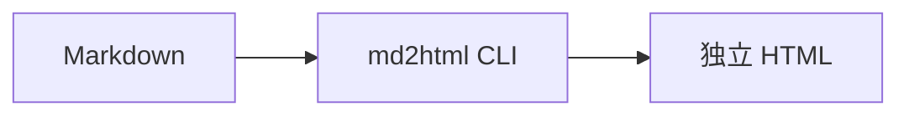

# 1. 简介

## 目录 • 1. 简介

- [1.1 简单 Mermaid](#11-简单-mermaid)
- [1.2 自定义卡片图](#12-自定义卡片图)

---

本页由 `md2html build` 生成，符合 [markdown-to-html](../SKILL.md) 技能规范。

## 1.1 简单 Mermaid  <a href="#toc-pos-11-简单-mermaid" class="md-toc-back" style="float:right;text-decoration:none;color:#5c6370"><svg xmlns="http://www.w3.org/2000/svg" width="10.5pt" height="10.5pt" viewBox="0 0 24 24" fill="none" stroke="currentColor" stroke-width="2" stroke-linecap="round" stroke-linejoin="round" style="vertical-align:-0.15em" aria-hidden="true"><path d="M9 14 4 9l5-5"/><path d="M20 20v-7a4 4 0 0 0-4-4H4"/></svg></a>

## 1.2 自定义卡片图  <a href="#toc-pos-12-自定义卡片图" class="md-toc-back" style="float:right;text-decoration:none;color:#5c6370"><svg xmlns="http://www.w3.org/2000/svg" width="10.5pt" height="10.5pt" viewBox="0 0 24 24" fill="none" stroke="currentColor" stroke-width="2" stroke-linecap="round" stroke-linejoin="round" style="vertical-align:-0.15em" aria-hidden="true"><path d="M9 14 4 9l5-5"/><path d="M20 20v-7a4 4 0 0 0-4-4H4"/></svg></a>

<!-- FIGURE: demo-stack -->

**图说明** 演示分层彩色卡片布局（sidecar 提供 HTML）。

# 2. 表格示例

| 列 | 说明 |
|---|---|
| build | 生成 HTML |
| analyze | 分析 Mermaid 是否应降级 |
