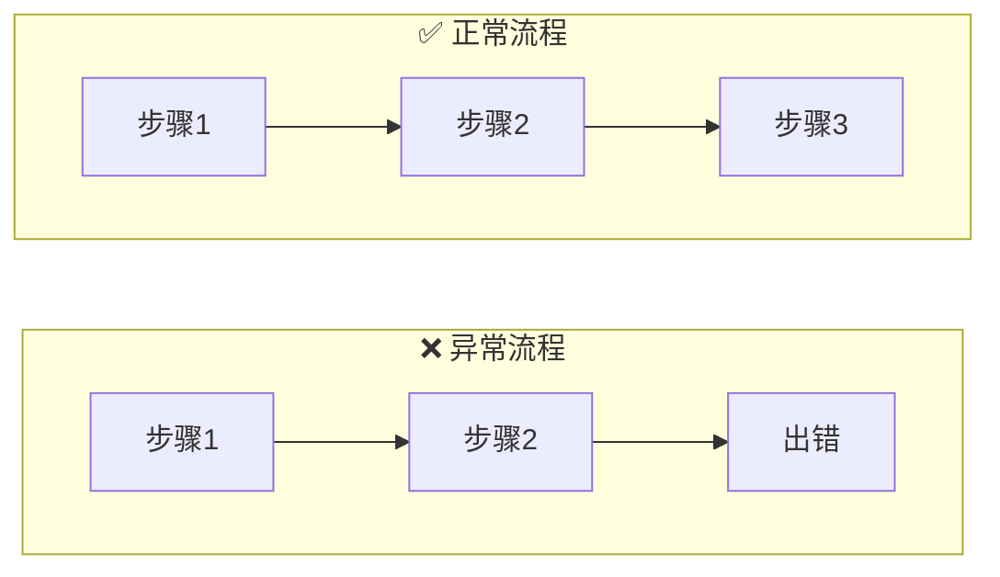
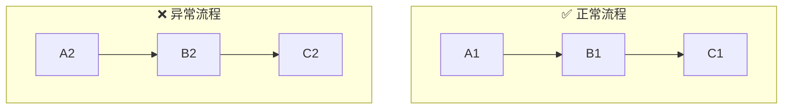

# Mermaid 流程图换行排版规则

当 Mermaid flowchart 中一行节点过多、显示拥挤时，按以下规则自动换行排版。

---

## 1. 多个 subgraph 分行显示

当 flowchart 包含 **2 个及以上 subgraph** 且它们之间无显式连接时，Mermaid 默认会将它们并排在同一行。必须强制分行。

### 做法

1. 主 flowchart 方向设为 `flowchart TB`（上下排列 subgraph）
2. 每个 subgraph 内部设 `direction LR`（节点从左到右）
3. 相邻 subgraph 之间用 **不可见链接 `~~~`** 强制分行

### 示例

### 反例（不要这样写）

> 缺少 `~~~` 和 `direction LR`，两个 subgraph 会挤在同一行。

---

## 2. 单行节点链过长时换行

当一个 subgraph 或 flowchart 内节点超过 **4-5 个**，横向显示会溢出屏幕时，需要手动换行。

### 做法

将长链拆分为多段，利用节点 ID 衔接实现折行：

或使用 `flowchart TB` + 子图内 `direction LR`，让 Mermaid 自动折行。

---

## 3. 规则优先级

| 场景 | 主方向 | subgraph 内部方向 | 是否需要 `~~~` |
|------|--------|-------------------|----------------|
| 多个 subgraph 对比 | `TB` | `LR` | 是 |
| 单个长链流程 | `LR` | — | 否 |
| subgraph 内节点多 | `TB` | `LR`，手动拆行 | 否 |

---

## 4. 注意事项

- `~~~` 是 Mermaid 的不可见链接语法，不会渲染任何箭头或线条
- `~~~` 两侧使用 subgraph 的 ID（即 `subgraph` 关键字后面的标识符）
- 每对相邻 subgraph 之间只需一个 `~~~`
- 如果有 3 个 subgraph（A、B、C），需要 `A ~~~ B` 和 `B ~~~ C`
