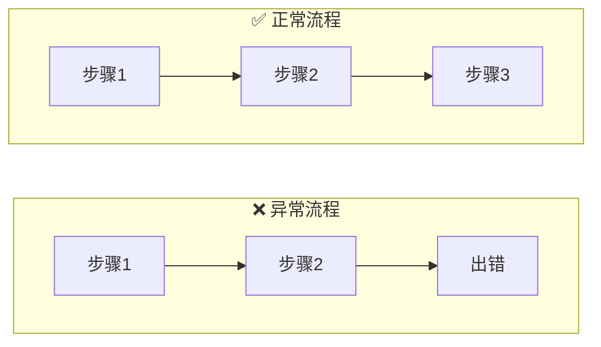
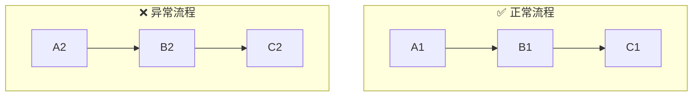
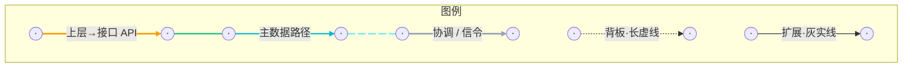

# Mermaid 流程图排版与架构图连线


## 目录 • Mermaid 流程图排版与架构图连线

- <a id="toc-pos-1-多个-subgraph-分行显示"></a>[1. 多个 subgraph 分行显示](#1-多个-subgraph-分行显示)
  - <a id="toc-pos-11-做法"></a>[1.1 做法](#11-做法)
  - <a id="toc-pos-12-示例"></a>[1.2 示例](#12-示例)
  - <a id="toc-pos-13-反例不要这样写"></a>[1.3 反例（不要这样写）](#13-反例不要这样写)
  - <a id="toc-pos-14-注意事项"></a>[1.4 注意事项](#14-注意事项)
- <a id="toc-pos-2-单行节点链过长时换行"></a>[2. 单行节点链过长时换行](#2-单行节点链过长时换行)
- <a id="toc-pos-3-跨域架构图避免连线穿插重要"></a>[3. 跨域架构图：避免连线穿插（重要）](#3-跨域架构图避免连线穿插重要)
  - <a id="toc-pos-31-问题"></a>[3.1 问题](#31-问题)
  - <a id="toc-pos-32-默认策略单张图--自上而下分层"></a>[3.2 默认策略：单张图 + 自上而下分层](#32-默认策略单张图--自上而下分层)
  - <a id="toc-pos-33-同层内左右列对齐并列子域"></a>[3.3 同层内：左右列对齐（并列子域）](#33-同层内左右列对齐并列子域)
  - <a id="toc-pos-34-上层内子组件收进运行时容器避免双汇聚"></a>[3.4 上层内：子组件收进运行时容器，避免双汇聚](#34-上层内子组件收进运行时容器避免双汇聚)
  - <a id="toc-pos-35-连线定义集中在图底部"></a>[3.5 连线定义集中在图底部](#35-连线定义集中在图底部)
  - <a id="toc-pos-36-仅在用户坚持时拆图"></a>[3.6 仅在用户坚持时拆图](#36-仅在用户坚持时拆图)
- <a id="toc-pos-4-语义配色与线型linkstyle"></a>[4. 语义配色与线型（`linkStyle`）](#4-语义配色与线型linkstyle)
- <a id="toc-pos-5-箭头说明文字"></a>[5. 箭头说明文字](#5-箭头说明文字)
- <a id="toc-pos-6-连线图例推荐独立迷你-mermaid-块"></a>[6. 连线图例（推荐：独立迷你 Mermaid 块）](#6-连线图例推荐独立迷你-mermaid-块)
- <a id="toc-pos-7-规则优先级汇总"></a>[7. 规则优先级（汇总）](#7-规则优先级汇总)
- <a id="toc-pos-8-检查清单编辑后自检"></a>[8. 检查清单（编辑后自检）](#8-检查清单编辑后自检)
- <a id="toc-pos-9-避免文字被裁切subgraph-标题与节点"></a>[9. 避免文字被裁切（subgraph 标题与节点）](#9-避免文字被裁切subgraph-标题与节点)
  - <a id="toc-pos-91-subgraph-标题"></a>[9.1 subgraph 标题](#91-subgraph-标题)
  - <a id="toc-pos-92-节点内文字"></a>[9.2 节点内文字](#92-节点内文字)
  - <a id="toc-pos-93-仍偏窄时"></a>[9.3 仍偏窄时](#93-仍偏窄时)
- <a id="toc-pos-10-其他说明"></a>[10. 其他说明](#10-其他说明)

---

涵盖：**多 subgraph 换行**、**跨域架构图少交叉**、**语义配色**、**独立图例**、**箭头说明**、**标题/节点防裁切**。

---

## 1. 多个 subgraph 分行显示 <a id="1-多个-subgraph-分行显示"></a> <a href="#toc-pos-1-多个-subgraph-分行显示" class="md-toc-back" style="float:right;text-decoration:none;color:#5c6370"><svg xmlns="http://www.w3.org/2000/svg" width="10.5pt" height="10.5pt" viewBox="0 0 24 24" fill="none" stroke="currentColor" stroke-width="2" stroke-linecap="round" stroke-linejoin="round" style="vertical-align:-0.15em" aria-hidden="true"><path d="M9 14 4 9l5-5"/><path d="M20 20v-7a4 4 0 0 0-4-4H4"/></svg></a>

当 flowchart 包含 **2 个及以上 subgraph** 且它们之间无显式连接时，Mermaid 默认会将它们并排在同一行。必须强制分行。

### 1.1 做法 <a id="11-做法"></a> <a href="#toc-pos-11-做法" class="md-toc-back" style="float:right;text-decoration:none;color:#5c6370"><svg xmlns="http://www.w3.org/2000/svg" width="10.5pt" height="10.5pt" viewBox="0 0 24 24" fill="none" stroke="currentColor" stroke-width="2" stroke-linecap="round" stroke-linejoin="round" style="vertical-align:-0.15em" aria-hidden="true"><path d="M9 14 4 9l5-5"/><path d="M20 20v-7a4 4 0 0 0-4-4H4"/></svg></a>

1. 主 flowchart 方向设为 `flowchart TB`（上下排列 subgraph）
2. 每个 subgraph 内部设 `direction LR`（节点从左到右）
3. 相邻 subgraph 之间用 **不可见链接 `~~~`** 强制分行

### 1.2 示例 <a id="12-示例"></a> <a href="#toc-pos-12-示例" class="md-toc-back" style="float:right;text-decoration:none;color:#5c6370"><svg xmlns="http://www.w3.org/2000/svg" width="10.5pt" height="10.5pt" viewBox="0 0 24 24" fill="none" stroke="currentColor" stroke-width="2" stroke-linecap="round" stroke-linejoin="round" style="vertical-align:-0.15em" aria-hidden="true"><path d="M9 14 4 9l5-5"/><path d="M20 20v-7a4 4 0 0 0-4-4H4"/></svg></a>



### 1.3 反例（不要这样写） <a id="13-反例不要这样写"></a> <a href="#toc-pos-13-反例不要这样写" class="md-toc-back" style="float:right;text-decoration:none;color:#5c6370"><svg xmlns="http://www.w3.org/2000/svg" width="10.5pt" height="10.5pt" viewBox="0 0 24 24" fill="none" stroke="currentColor" stroke-width="2" stroke-linecap="round" stroke-linejoin="round" style="vertical-align:-0.15em" aria-hidden="true"><path d="M9 14 4 9l5-5"/><path d="M20 20v-7a4 4 0 0 0-4-4H4"/></svg></a>



> 缺少 `~~~` 和 `direction LR`，两个 subgraph 会挤在同一行。

### 1.4 注意事项 <a id="14-注意事项"></a> <a href="#toc-pos-14-注意事项" class="md-toc-back" style="float:right;text-decoration:none;color:#5c6370"><svg xmlns="http://www.w3.org/2000/svg" width="10.5pt" height="10.5pt" viewBox="0 0 24 24" fill="none" stroke="currentColor" stroke-width="2" stroke-linecap="round" stroke-linejoin="round" style="vertical-align:-0.15em" aria-hidden="true"><path d="M9 14 4 9l5-5"/><path d="M20 20v-7a4 4 0 0 0-4-4H4"/></svg></a>

- `~~~` 是 Mermaid 的不可见链接，**不渲染箭头**
- `~~~` 两侧使用 subgraph 的 **ID**（`subgraph` 关键字后的标识符）
- 每对相邻 subgraph 之间只需一个 `~~~`；A、B、C 三层需 `A ~~~ B` 与 `B ~~~ C`

---

## 2. 单行节点链过长时换行 <a id="2-单行节点链过长时换行"></a> <a href="#toc-pos-2-单行节点链过长时换行" class="md-toc-back" style="float:right;text-decoration:none;color:#5c6370"><svg xmlns="http://www.w3.org/2000/svg" width="10.5pt" height="10.5pt" viewBox="0 0 24 24" fill="none" stroke="currentColor" stroke-width="2" stroke-linecap="round" stroke-linejoin="round" style="vertical-align:-0.15em" aria-hidden="true"><path d="M9 14 4 9l5-5"/><path d="M20 20v-7a4 4 0 0 0-4-4H4"/></svg></a>

节点超过 **4–5 个** 且横向溢出时，拆链或子图内 `direction LR` 折行：


---

## 3. 跨域架构图：避免连线穿插（重要） <a id="3-跨域架构图避免连线穿插重要"></a> <a href="#toc-pos-3-跨域架构图避免连线穿插重要" class="md-toc-back" style="float:right;text-decoration:none;color:#5c6370"><svg xmlns="http://www.w3.org/2000/svg" width="10.5pt" height="10.5pt" viewBox="0 0 24 24" fill="none" stroke="currentColor" stroke-width="2" stroke-linecap="round" stroke-linejoin="round" style="vertical-align:-0.15em" aria-hidden="true"><path d="M9 14 4 9l5-5"/><path d="M20 20v-7a4 4 0 0 0-4-4H4"/></svg></a>

### 3.1 问题 <a id="31-问题"></a> <a href="#toc-pos-31-问题" class="md-toc-back" style="float:right;text-decoration:none;color:#5c6370"><svg xmlns="http://www.w3.org/2000/svg" width="10.5pt" height="10.5pt" viewBox="0 0 24 24" fill="none" stroke="currentColor" stroke-width="2" stroke-linecap="round" stroke-linejoin="round" style="vertical-align:-0.15em" aria-hidden="true"><path d="M9 14 4 9l5-5"/><path d="M20 20v-7a4 4 0 0 0-4-4H4"/></svg></a>

多个 subgraph **左右并排**（如「层 A | 层 B | 层 C | 层 D」四列）时，跨 subgraph 的边会被 Mermaid 自动拉成**最短路径**，经常**横穿无关节点/子图**，视觉很乱。

### 3.2 默认策略：单张图 + 自上而下分层 <a id="32-默认策略单张图--自上而下分层"></a> <a href="#toc-pos-32-默认策略单张图--自上而下分层" class="md-toc-back" style="float:right;text-decoration:none;color:#5c6370"><svg xmlns="http://www.w3.org/2000/svg" width="10.5pt" height="10.5pt" viewBox="0 0 24 24" fill="none" stroke="currentColor" stroke-width="2" stroke-linecap="round" stroke-linejoin="round" style="vertical-align:-0.15em" aria-hidden="true"><path d="M9 14 4 9l5-5"/><path d="M20 20v-7a4 4 0 0 0-4-4H4"/></svg></a>

- **优先一张图**展示全貌；用户未明确要求时**不要**拆成多张图。
- 主方向 **`flowchart TB`**：按**逻辑层**自上而下排列（例如 `上层 → 中层 → 下层`）。
- 层间用 **`~~~`** 强制分行（见 §1）。
- **禁止**仅靠多列并排 + 斜穿全图的长边。

### 3.3 同层内：左右列对齐（并列子域） <a id="33-同层内左右列对齐并列子域"></a> <a href="#toc-pos-33-同层内左右列对齐并列子域" class="md-toc-back" style="float:right;text-decoration:none;color:#5c6370"><svg xmlns="http://www.w3.org/2000/svg" width="10.5pt" height="10.5pt" viewBox="0 0 24 24" fill="none" stroke="currentColor" stroke-width="2" stroke-linecap="round" stroke-linejoin="round" style="vertical-align:-0.15em" aria-hidden="true"><path d="M9 14 4 9l5-5"/><path d="M20 20v-7a4 4 0 0 0-4-4H4"/></svg></a>

某一逻辑层内部若有两条**独立路径**（如主数据通路与协调/信令通路），用 `direction LR` 建**左、右两列**，列内 `direction TB` 自上而下：

```mermaid
subgraph MID["中层（示例）"]
    direction LR
    subgraph COL_L["左列 · 主数据路径"]
        direction TB
        BRIDGE["协议适配 / 缓冲"]
        WORKER["处理单元"]
    end
    COL_L ~~~ COL_R
    subgraph COL_R["右列 · 协调路径"]
        direction TB
        COORD["协调服务"]
        SIGNAL["信令 / 状态"]
        COORD --> SIGNAL
    end
end
```

**跨层连线规则**（减少交叉）：

| 源（上层） | 目标（下层） | 原则 |
|------------|--------------|------|
| 左列上的组件 | 左列顶层节点 | **同列垂直下落** |
| 右列上的组件 | 右列顶层节点 | **同列垂直下落** |
| 左列底端 | 下层左端扩展 | 仅当语义属于主数据外延 |
| 右列底端 | 下层右端扩展 | 仅当语义属于协调/外部信令 |

用 **`源节点 ~~~ 目标列顶节点`** 做列对齐（仍不画箭头）：

```mermaid
SVC_A ~~~ BRIDGE
SVC_B ~~~ COORD
SVC_A ==>|批量传输 / API| BRIDGE
SVC_B -->|配置 / 路由| COORD
```

### 3.4 上层内：子组件收进运行时容器，避免双汇聚 <a id="34-上层内子组件收进运行时容器避免双汇聚"></a> <a href="#toc-pos-34-上层内子组件收进运行时容器避免双汇聚" class="md-toc-back" style="float:right;text-decoration:none;color:#5c6370"><svg xmlns="http://www.w3.org/2000/svg" width="10.5pt" height="10.5pt" viewBox="0 0 24 24" fill="none" stroke="currentColor" stroke-width="2" stroke-linecap="round" stroke-linejoin="round" style="vertical-align:-0.15em" aria-hidden="true"><path d="M9 14 4 9l5-5"/><path d="M20 20v-7a4 4 0 0 0-4-4H4"/></svg></a>

两个**并排子组件**各画一条边汇聚到下方**同一运行时节点**，容易在汇合处打成线团。

**改法**：用**运行时容器** subgraph **包住**并排子组件，**不再**画 `子组件 → 运行时`；上层入口只连子组件：

```mermaid
subgraph RUNTIME["运行时环境"]
    direction LR
    SVC_A["服务 A"]
    SVC_A ~~~ SVC_B
    SVC_B["服务 B"]
end
CLIENT ==>|公开 API| SVC_A
CLIENT ==>|公开 API| SVC_B
```

### 3.5 连线定义集中在图底部 <a id="35-连线定义集中在图底部"></a> <a href="#toc-pos-35-连线定义集中在图底部" class="md-toc-back" style="float:right;text-decoration:none;color:#5c6370"><svg xmlns="http://www.w3.org/2000/svg" width="10.5pt" height="10.5pt" viewBox="0 0 24 24" fill="none" stroke="currentColor" stroke-width="2" stroke-linecap="round" stroke-linejoin="round" style="vertical-align:-0.15em" aria-hidden="true"><path d="M9 14 4 9l5-5"/><path d="M20 20v-7a4 4 0 0 0-4-4H4"/></svg></a>

先写齐 **节点/subgraph**，再在**图末**统一写跨层边，便于维护 `linkStyle` 序号：

```mermaid
    %% … 节点与 subgraph …

    CLIENT ==>|说明| SVC_A
    SVC_A ==>|说明| BRIDGE
    %% …

    linkStyle 0,1 stroke:#F59E0B,stroke-width:2.5px
    linkStyle 2 stroke:#10B981,stroke-width:2px
```

### 3.6 仅在用户坚持时拆图 <a id="36-仅在用户坚持时拆图"></a> <a href="#toc-pos-36-仅在用户坚持时拆图" class="md-toc-back" style="float:right;text-decoration:none;color:#5c6370"><svg xmlns="http://www.w3.org/2000/svg" width="10.5pt" height="10.5pt" viewBox="0 0 24 24" fill="none" stroke="currentColor" stroke-width="2" stroke-linecap="round" stroke-linejoin="round" style="vertical-align:-0.15em" aria-hidden="true"><path d="M9 14 4 9l5-5"/><path d="M20 20v-7a4 4 0 0 0-4-4H4"/></svg></a>

若单图经 §3.3–3.5 仍无法接受，再按逻辑层拆为多张图，并注明阅读顺序。**默认不拆。**

---

## 4. 语义配色与线型（`linkStyle`） <a id="4-语义配色与线型linkstyle"></a> <a href="#toc-pos-4-语义配色与线型linkstyle" class="md-toc-back" style="float:right;text-decoration:none;color:#5c6370"><svg xmlns="http://www.w3.org/2000/svg" width="10.5pt" height="10.5pt" viewBox="0 0 24 24" fill="none" stroke="currentColor" stroke-width="2" stroke-linecap="round" stroke-linejoin="round" style="vertical-align:-0.15em" aria-hidden="true"><path d="M9 14 4 9l5-5"/><path d="M20 20v-7a4 4 0 0 0-4-4H4"/></svg></a>

用 **颜色 + 线型** 区分路径类型；`linkStyle` 按边**出现顺序**从 0 编号（`~~~` 不计入）。

| 语义（通用） | 箭头写法 | linkStyle 建议 |
|--------------|----------|----------------|
| 上层 → 接口 / 库（用户可见 API） | `==>` 粗实线 | `#F59E0B`，`stroke-width:2.5px` |
| 主数据路径 | `-->` 实线 | `#10B981`，`2–2.5px` |
| 协调 / 信令 / 配置路径 | `-->` 实线 | `#06B6D4`，`2px` |
| 配置流（慢路径） | `-.->` 短虚线 | `#3B82F6`，`stroke-dasharray:4 4` |
| 硬件或物理信号 | `-.->` 长虚线 | `#67E8F9`，`stroke-dasharray:12 4`（勿与配置/扩展混用同一 dash） |
| 外部扩展 / 远程 / 总线延伸 | `-->` **实线** | `#94A3B8`，`stroke-width:2.5px`（**不用** `-.->`，否则与虚线难区分） |
| 跨边界衔接（可选第三色） | `-->` 实线 | `#22D3EE`，`2px` |

暗色主题 `themeVariables` 与 `classDef` 配色应与**当前项目**文档约定一致（勿在 skill 内写死某一产品色板）。

---

## 5. 箭头说明文字 <a id="5-箭头说明文字"></a> <a href="#toc-pos-5-箭头说明文字" class="md-toc-back" style="float:right;text-decoration:none;color:#5c6370"><svg xmlns="http://www.w3.org/2000/svg" width="10.5pt" height="10.5pt" viewBox="0 0 24 24" fill="none" stroke="currentColor" stroke-width="2" stroke-linecap="round" stroke-linejoin="round" style="vertical-align:-0.15em" aria-hidden="true"><path d="M9 14 4 9l5-5"/><path d="M20 20v-7a4 4 0 0 0-4-4H4"/></svg></a>

跨层、易误解的边应加 **`|说明|`**，写清**传递的内容或机制**，而非仅「连接」：

```mermaid
CLIENT ==>|公开 API：创建任务 / 读写| SVC_A
SVC_A ==>|协议封装 · 批量 IO| BRIDGE
SVC_B -->|路由表 / 策略下发| COORD
SIGNAL -.->|物理信令线| ACTUATOR
BRIDGE -.->|透明总线 / 隧道| EXT_NODE
```

- 标签过长时用 `<br/>` 换行，或略写后在**当前业务文档**中补一句。
- 图例中的样本边应使用**同类抽象标签**，与主图风格一致。

---

## 6. 连线图例（推荐：独立迷你 Mermaid 块） <a id="6-连线图例推荐独立迷你-mermaid-块"></a> <a href="#toc-pos-6-连线图例推荐独立迷你-mermaid-块" class="md-toc-back" style="float:right;text-decoration:none;color:#5c6370"><svg xmlns="http://www.w3.org/2000/svg" width="10.5pt" height="10.5pt" viewBox="0 0 24 24" fill="none" stroke="currentColor" stroke-width="2" stroke-linecap="round" stroke-linejoin="round" style="vertical-align:-0.15em" aria-hidden="true"><path d="M9 14 4 9l5-5"/><path d="M20 20v-7a4 4 0 0 0-4-4H4"/></svg></a>

Mermaid **无原生 `legend`**。要**真实线型/颜色**且不影响主图 `linkStyle` 时，用 **方案 D**：

- 主图与图例各一个 ` ```mermaid ` 块；
- 图例块内边从 0 编号，**独立** `linkStyle`；
- **横向紧凑**：`flowchart LR`，样本边一排，`~~~` 分隔。



| 方案 | 集成方式 | 真实线型 | 维护 |
|------|----------|----------|------|
| Markdown 表 | 图外 | 否 | 低 |
| 主图内文本 subgraph | 单图 | 否 | 低 |
| 主图内样本边 | 单图 | 是 | **高**（打乱主图 linkStyle 序号） |
| **独立迷你图例块（D）** | 同节第二块 | 是 | **中（推荐）** |

正文写「见下图例」，**不必**再重复整张 Markdown 表。

---

## 7. 规则优先级（汇总） <a id="7-规则优先级汇总"></a> <a href="#toc-pos-7-规则优先级汇总" class="md-toc-back" style="float:right;text-decoration:none;color:#5c6370"><svg xmlns="http://www.w3.org/2000/svg" width="10.5pt" height="10.5pt" viewBox="0 0 24 24" fill="none" stroke="currentColor" stroke-width="2" stroke-linecap="round" stroke-linejoin="round" style="vertical-align:-0.15em" aria-hidden="true"><path d="M9 14 4 9l5-5"/><path d="M20 20v-7a4 4 0 0 0-4-4H4"/></svg></a>

| 场景 | 主方向 | subgraph 内 | `~~~` | 备注 |
|------|--------|---------------|-------|------|
| 多个 subgraph 对比/分层 | `TB` | `LR` | 层间必须 | §1 |
| 跨域多层架构 | `TB` | 同层内可 `LR` 双列 | 层间 + 列对齐 | §3 |
| 单条长流程链 | `LR` 或 `TB` | — | 视情况 | §2 |
| 需要图例 | 主图 `TB` + 图例 `LR` | — | 图例独立块 | §6 |

---

## 8. 检查清单（编辑后自检） <a id="8-检查清单编辑后自检"></a> <a href="#toc-pos-8-检查清单编辑后自检" class="md-toc-back" style="float:right;text-decoration:none;color:#5c6370"><svg xmlns="http://www.w3.org/2000/svg" width="10.5pt" height="10.5pt" viewBox="0 0 24 24" fill="none" stroke="currentColor" stroke-width="2" stroke-linecap="round" stroke-linejoin="round" style="vertical-align:-0.15em" aria-hidden="true"><path d="M9 14 4 9l5-5"/><path d="M20 20v-7a4 4 0 0 0-4-4H4"/></svg></a>

- [ ] 是否 `flowchart TB` 分层，而非多域左右并排？
- [ ] 层间是否用 `LAYER_A ~~~ LAYER_B ~~~ …` 分隔？
- [ ] 并列路径是否分左右列，跨层边是否**同列下落**（左→左、右→右）？
- [ ] 是否避免「两子组件 → 同一运行时」双汇聚（子组件是否已在运行时容器内）？
- [ ] 跨层边与 `linkStyle` 是否集中在图底部？
- [ ] 关键边是否有 `|说明|`？
- [ ] 若需图例：是否独立第二块、横向紧凑，且未破坏主图 linkStyle 序号？
- [ ] **subgraph 标题**是否用 `<br>` 折行或已缩短，预览时无裁切？
- [ ] **节点标签**过长时是否已用 `<br>` 分行（勿单行塞满括号说明）？

---

## 9. 避免文字被裁切（subgraph 标题与节点） <a id="9-避免文字被裁切subgraph-标题与节点"></a> <a href="#toc-pos-9-避免文字被裁切subgraph-标题与节点" class="md-toc-back" style="float:right;text-decoration:none;color:#5c6370"><svg xmlns="http://www.w3.org/2000/svg" width="10.5pt" height="10.5pt" viewBox="0 0 24 24" fill="none" stroke="currentColor" stroke-width="2" stroke-linecap="round" stroke-linejoin="round" style="vertical-align:-0.15em" aria-hidden="true"><path d="M9 14 4 9l5-5"/><path d="M20 20v-7a4 4 0 0 0-4-4H4"/></svg></a>

Mermaid **subgraph 外框宽度由内部节点决定**，标题若比内容更宽，会在框顶**被裁切或压住**（常见于「控制器域（单一 …）」这类长标题 + 窄子图）。

### 9.1 subgraph 标题 <a id="91-subgraph-标题"></a> <a href="#toc-pos-91-subgraph-标题" class="md-toc-back" style="float:right;text-decoration:none;color:#5c6370"><svg xmlns="http://www.w3.org/2000/svg" width="10.5pt" height="10.5pt" viewBox="0 0 24 24" fill="none" stroke="currentColor" stroke-width="2" stroke-linecap="round" stroke-linejoin="round" style="vertical-align:-0.15em" aria-hidden="true"><path d="M9 14 4 9l5-5"/><path d="M20 20v-7a4 4 0 0 0-4-4H4"/></svg></a>

| 做法 | 示例 |
|------|------|
| **`<br>` 折成 2 行**（首选） | `subgraph CTRL["控制器域<br/>单一 NI Linux RT / Windows"]` |
| **缩短标题**，限定语进子图首节点 | `subgraph CTRL["控制器域"]` + 内层 `CAP["单一 NI Linux RT / Windows"]` |
| **避免**单行超长括号 | ~~`控制器域（单一 NI Linux RT / Windows）`~~ |

折行位置：在**语义断点**（域名称 / 限定语、名词 / 括号说明之间），不要在一串英文中间硬断。

### 9.2 节点内文字 <a id="92-节点内文字"></a> <a href="#toc-pos-92-节点内文字" class="md-toc-back" style="float:right;text-decoration:none;color:#5c6370"><svg xmlns="http://www.w3.org/2000/svg" width="10.5pt" height="10.5pt" viewBox="0 0 24 24" fill="none" stroke="currentColor" stroke-width="2" stroke-linecap="round" stroke-linejoin="round" style="vertical-align:-0.15em" aria-hidden="true"><path d="M9 14 4 9l5-5"/><path d="M20 20v-7a4 4 0 0 0-4-4H4"/></svg></a>

节点标签同样用 `<br>`，例如 `["NI Linux RT<br/>PREEMPT_RT · SMP"]`。边标签 `|说明|` 保持**短句**；过长说明写在图下正文。

### 9.3 仍偏窄时 <a id="93-仍偏窄时"></a> <a href="#toc-pos-93-仍偏窄时" class="md-toc-back" style="float:right;text-decoration:none;color:#5c6370"><svg xmlns="http://www.w3.org/2000/svg" width="10.5pt" height="10.5pt" viewBox="0 0 24 24" fill="none" stroke="currentColor" stroke-width="2" stroke-linecap="round" stroke-linejoin="round" style="vertical-align:-0.15em" aria-hidden="true"><path d="M9 14 4 9l5-5"/><path d="M20 20v-7a4 4 0 0 0-4-4H4"/></svg></a>

- 子图内加**与标题同宽的说明节点**（`classDef info`），或加宽最宽业务节点文案。
- `init` 中适度增大 `flowchart.padding`（如 `8–12`），**不能**单独解决标题溢出，仅改善边距。
- 编辑后**预览主图**，重点看 subgraph 顶栏与边标签是否完整。

---

## 10. 其他说明 <a id="10-其他说明"></a> <a href="#toc-pos-10-其他说明" class="md-toc-back" style="float:right;text-decoration:none;color:#5c6370"><svg xmlns="http://www.w3.org/2000/svg" width="10.5pt" height="10.5pt" viewBox="0 0 24 24" fill="none" stroke="currentColor" stroke-width="2" stroke-linecap="round" stroke-linejoin="round" style="vertical-align:-0.15em" aria-hidden="true"><path d="M9 14 4 9l5-5"/><path d="M20 20v-7a4 4 0 0 0-4-4H4"/></svg></a>

- 导出到部分协作平台时，主图与图例可能被渲染为**两个独立画板**，属平台行为，非 Mermaid 语法问题。
- **Skill 正文保持领域无关**：具体产品名、硬件名、仓库路径应写在**业务文档**的图中，不要写进本 skill。
