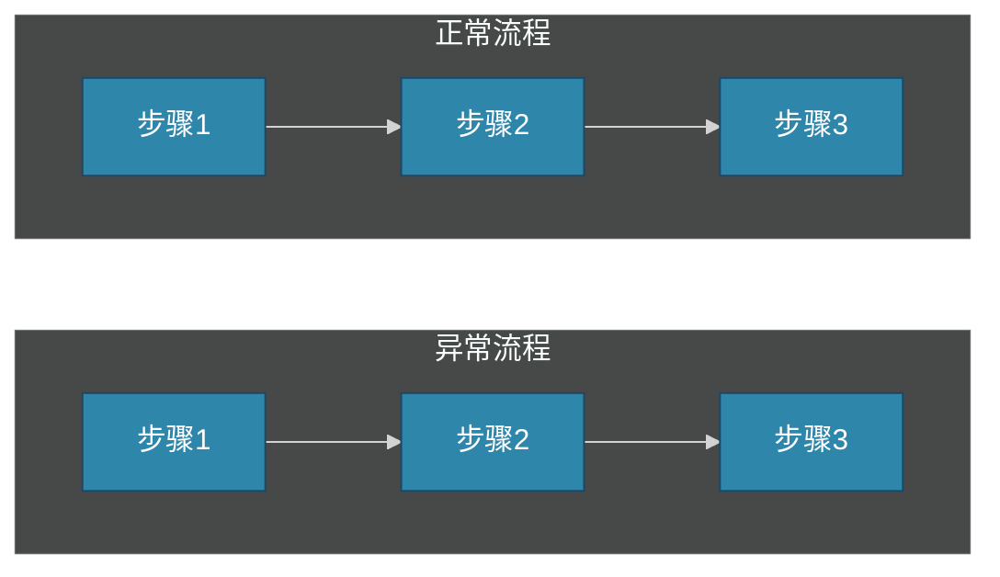
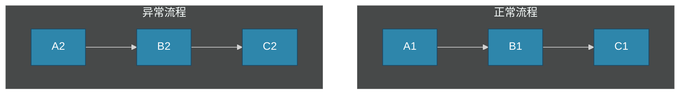
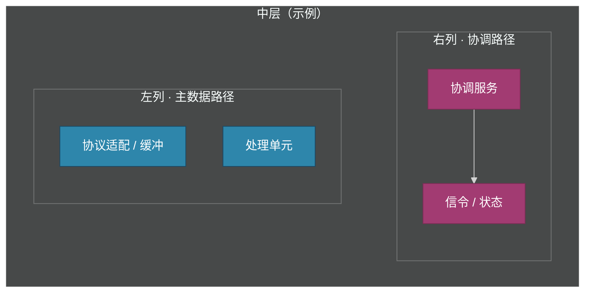
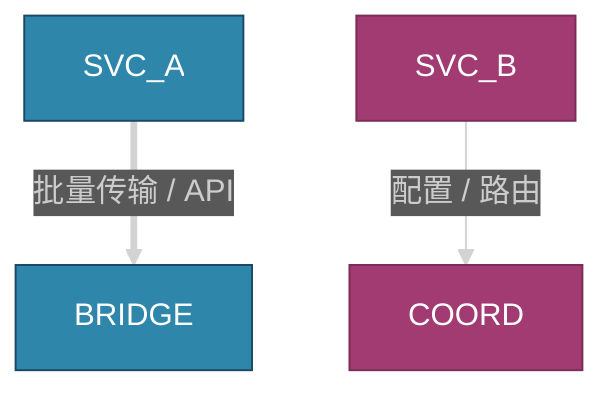
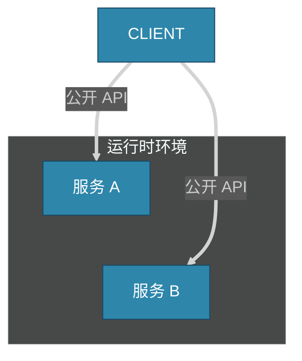
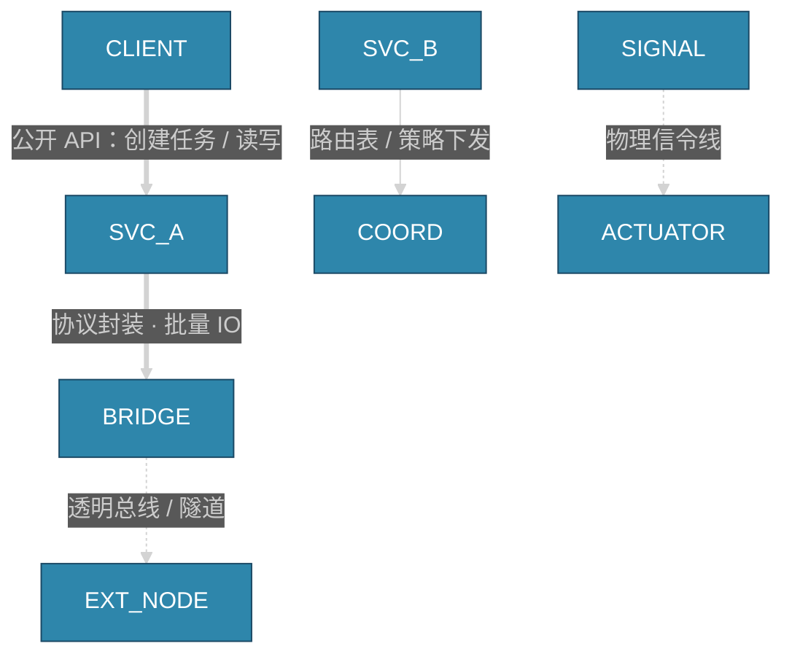
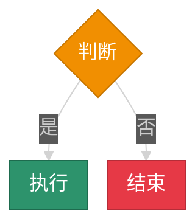

# Mermaid 流程图排版与架构图连线

不确定该不该用 Mermaid flowchart（相对胶囊图、深色卡片墙、时间表）→ 先读 `diagram-style-catalog`。


## 目录 • Mermaid 流程图排版与架构图连线

- [0. 深彩色配色（硬规则，先于排版）](#0-深彩色配色硬规则先于排版)
- [1. 多个 subgraph 分行显示](#1-多个-subgraph-分行显示)
  - [1.1 做法](#11-做法)
  - [1.2 示例](#12-示例)
  - [1.3 反例（不要这样写）](#13-反例不要这样写)
  - [1.4 排版线必须隐形（硬规则）](#14-排版线必须隐形硬规则)
- [2. 单行节点链过长时换行](#2-单行节点链过长时换行)
- [3. 跨域架构图：避免连线穿插（重要）](#3-跨域架构图避免连线穿插重要)
  - [3.1 问题](#31-问题)
  - [3.2 默认策略：单张图 + 自上而下分层](#32-默认策略单张图--自上而下分层)
  - [3.3 同层内：左右列对齐（并列子域）](#33-同层内左右列对齐并列子域)
  - [3.4 上层内：子组件收进运行时容器，避免双汇聚](#34-上层内子组件收进运行时容器避免双汇聚)
  - [3.5 连线定义集中在图底部](#35-连线定义集中在图底部)
  - [3.6 仅在用户坚持时拆图](#36-仅在用户坚持时拆图)
- [4. 语义配色与线型（`linkStyle`）](#4-语义配色与线型linkstyle)
- [5. 箭头说明文字](#5-箭头说明文字)
- [6. 连线图例（默认不加；仅复杂架构图）](#6-连线图例默认不加仅复杂架构图)
  - [6.1 默认：小图禁止图例](#61-默认小图禁止图例)
  - [6.2 何时才加图例](#62-何时才加图例)
  - [6.3 需要时的画法（方案 D）](#63-需要时的画法方案-d)
- [7. 规则优先级（汇总）](#7-规则优先级汇总)
- [8. 检查清单（编辑后自检）](#8-检查清单编辑后自检)
- [9. 其他说明](#9-其他说明)
- [10. 小流程图不要拉满栏宽](#10-小流程图不要拉满栏宽)
- [11. 文字必须完整露出](#11-文字必须完整露出)

---

涵盖：**深彩色节点配色（硬规则）**、**文字必须完整露出**、**多 subgraph 换行**、**跨域架构图少交叉**、**排版线必须隐形**、**连线语义配色**、**箭头说明**、**小图按内容尺寸显示且不加图例**、**仅复杂架构图才用独立图例**。

---

## 0. 深彩色配色（硬规则，先于排版）

排版之前先上色。**本 skill 里凡是 ` ```mermaid ` 围栏（含反例）都必须深彩色**，禁止再放可渲染的默认浅色图。反例只示范排版错误，配色仍要合格；不要因为「这是反例」就把 `theme`/`classDef` 拿掉。

写每一张图之前先读三遍：

1. 所有的 Mermaid 图表都使用深彩色配色方案，以便适合在暗色主题环境中查看，同时保持良好的对比度和可读性。
2. 所有的 Mermaid 图表都使用深彩色配色方案，以便适合在暗色主题环境中查看，同时保持良好的对比度和可读性。
3. 所有的 Mermaid 图表都使用深彩色配色方案，以便适合在暗色主题环境中查看，同时保持良好的对比度和可读性。

**REQUIRED：** 节点色板、禁止项、借口对照见 **`markdown-export`** §5。最低限度每张图都要：

- 第一行 `%%{init: {'theme': 'dark'}}%%`（小图再加 `useMaxWidth:false`，§10）
- 每个可见节点 `classDef`/`style`：深彩色 `fill` + 浅色字（`color:#FFFFFF`）
- **禁止**只写 `theme: dark` 就交差；**禁止**白底/浅灰默认节点

连线 `linkStyle`（§4）是路径语义，**不能代替**节点深彩色。

---

## 1. 多个 subgraph 分行显示

当 flowchart 包含 **2 个及以上 subgraph** 且它们之间无显式连接时，Mermaid 默认会将它们并排在同一行。必须强制分行。

### 1.1 做法

1. 主 flowchart 方向设为 `flowchart TB`（上下排列 subgraph）
2. 每个 subgraph 内部设 `direction LR`（节点从左到右）
3. 相邻 subgraph **没有语义边**时，用 **无箭头占位边 `---` + 隐形 `linkStyle`** 强制分行（见 §1.4）。**禁止**裸写 `~~~`。

### 1.2 示例

占位边写在语义边之前，`linkStyle 0` 固定用来消掉它：


```mermaid
%%{init: {'theme': 'dark'}}%%
flowchart TB
    subgraph 正常流程["正常流程"]
        direction LR
        A1["步骤1"]
        B1["步骤2"]
        C1["步骤3"]
    end

    subgraph 异常流程["异常流程"]
        direction LR
        A2["步骤1"]
        B2["步骤2"]
        C2["步骤3"]
    end

    正常流程 --- 异常流程
    A1 --> B1 --> C1
    A2 --> B2 --> C2
    linkStyle 0 opacity:0,stroke-width:0px
    classDef n fill:#2E86AB,stroke:#1B4965,color:#FFFFFF
    class A1,B1,C1,A2,B2,C2 n
```

### 1.3 反例（不要这样写）

**反例 A**：既没有占位边、层间也没有语义边，两个 subgraph 会挤在同一行。配色仍用深彩色——错的是分行，不是配色。


```mermaid
%%{init: {'theme': 'dark'}}%%
flowchart TB
    subgraph 正常流程["正常流程"]
        A1 --> B1 --> C1
    end
    subgraph 异常流程["异常流程"]
        A2 --> B2 --> C2
    end
    classDef n fill:#2E86AB,stroke:#1B4965,color:#FFFFFF
    class A1,B1,C1,A2,B2,C2 n
```

**反例 B**：层间已有 `-->` / `==>`，再写 `~~~` 或 `---`。预览会出现**无箭头灰线**（幽灵线）。有语义边就足以分行，不要再加占位边。

**反例 C**：使用 `~~~`。官方说不可见，但 Cursor 与部分 Mermaid 预览仍会画出无箭头细线，且 **`~~~` 不占用 `linkStyle` 序号，无法被消掉**。

### 1.4 排版线必须隐形（硬规则）

**预览里不得出现无箭头灰线。** 排版用的占位边必须对读者完全不可见。

按下面做，不要谈判：

| 情况 | 做法 |
|------|------|
| 层间 / 列间 **已有** `-->` `==>` `-.->` 等语义边 | **不加**任何占位边（不要 `~~~`，也不要 `---`） |
| 必须分行或对齐，且 **没有**语义边 | 用 `A --- B`（subgraph **ID**），并立刻用 `linkStyle` 消掉 |

隐形写法（必须三件事同时做）：

```text
linkStyle N opacity:0,stroke-width:0px
```

- `N` 是该占位边在全图中的序号（从 0 计，**含** subgraph 内已写出的边）。
- 多条占位边可合并：`linkStyle 0,1 opacity:0,stroke-width:0px`。
- **推荐**：先写齐全部占位 `---`，再写语义边，这样隐形序号永远是 `0..(k-1)`，语义边从 `k` 开始着色。

**禁止：**

- 裸 `~~~`（画得出、涂不掉）
- 只给语义边写 `linkStyle`、占位边不写隐形（占位边会被画成默认灰线）
- 以为「`~~~` 不渲染箭头所以可以当隐形」——无箭头 ≠ 隐形

自检：若预览能数出无箭头的线，图不合格，必须删占位或补隐形 `linkStyle`。

---

## 2. 单行节点链过长时换行

节点超过 **4–5 个** 且横向溢出时，拆链或子图内 `direction LR` 折行：


```mermaid
%%{init: {'theme': 'dark'}}%%
flowchart LR
    A --> B --> C --> D
    D --> E --> F --> G
    classDef n fill:#2E86AB,stroke:#1B4965,color:#FFFFFF
    class A,B,C,D,E,F,G n
```

---

## 3. 跨域架构图：避免连线穿插（重要）

### 3.1 问题

多个 subgraph **左右并排**（如「层 A | 层 B | 层 C | 层 D」四列）时，跨 subgraph 的边会被 Mermaid 自动拉成**最短路径**，经常**横穿无关节点/子图**，视觉很乱。

### 3.2 默认策略：单张图 + 自上而下分层

- **优先一张图**展示全貌；用户未明确要求时**不要**拆成多张图。
- 主方向 **`flowchart TB`**：按**逻辑层**自上而下排列（例如 `上层 → 中层 → 下层`）。
- 层间若已有语义边，靠语义边分行（见 §1.4）；**仅当没有语义边**时才按 §1 加隐形 `---`。
- **禁止**仅靠多列并排 + 斜穿全图的长边。

### 3.3 同层内：左右列对齐（并列子域）

某一逻辑层内部若有两条**独立路径**（如主数据通路与协调/信令通路），用 `direction LR` 建**左、右两列**，列内 `direction TB` 自上而下：


```mermaid
%%{init: {'theme': 'dark'}}%%
flowchart TB
    subgraph MID["中层（示例）"]
        direction LR
        subgraph COL_L["左列 · 主数据路径"]
            direction TB
            BRIDGE["协议适配 / 缓冲"]
            WORKER["处理单元"]
        end
        COL_L --- COL_R
        subgraph COL_R["右列 · 协调路径"]
            direction TB
            COORD["协调服务"]
            SIGNAL["信令 / 状态"]
            COORD --> SIGNAL
        end
    end
    linkStyle 0 opacity:0,stroke-width:0px
    classDef n fill:#2E86AB,stroke:#1B4965,color:#FFFFFF
    classDef alt fill:#A23B72,stroke:#7B2D55,color:#FFFFFF
    class BRIDGE,WORKER n
    class COORD,SIGNAL alt
```

`COL_L --- COL_R` 是占位边，必须按 §1.4 隐形（上图 `linkStyle 0`）。

**跨层连线规则**（减少交叉）：

| 源（上层） | 目标（下层） | 原则 |
|------------|--------------|------|
| 左列上的组件 | 左列顶层节点 | **同列垂直下落** |
| 右列上的组件 | 右列顶层节点 | **同列垂直下落** |
| 左列底端 | 下层左端扩展 | 仅当语义属于主数据外延 |
| 右列底端 | 下层右端扩展 | 仅当语义属于协调/外部信令 |

用 **`源节点 --- 目标列顶节点`** 做列对齐，且仅当二者之间**还没有**语义边时才加；加上后必须按 §1.4 隐形。已有 `==>` / `-->` 就不要再加占位边：


```mermaid
%%{init: {'theme': 'dark'}}%%
flowchart TB
    SVC_A ==>|批量传输 / API| BRIDGE
    SVC_B -->|配置 / 路由| COORD
    classDef n fill:#2E86AB,stroke:#1B4965,color:#FFFFFF
    classDef alt fill:#A23B72,stroke:#7B2D55,color:#FFFFFF
    class SVC_A,BRIDGE n
    class SVC_B,COORD alt
```

### 3.4 上层内：子组件收进运行时容器，避免双汇聚

两个**并排子组件**各画一条边汇聚到下方**同一运行时节点**，容易在汇合处打成线团。

**改法**：用**运行时容器** subgraph **包住**并排子组件，**不再**画 `子组件 → 运行时`；上层入口只连子组件：


```mermaid
%%{init: {'theme': 'dark'}}%%
flowchart TB
    subgraph RUNTIME["运行时环境"]
        direction LR
        SVC_A["服务 A"]
        SVC_A --- SVC_B
        SVC_B["服务 B"]
    end
    CLIENT ==>|公开 API| SVC_A
    CLIENT ==>|公开 API| SVC_B
    linkStyle 0 opacity:0,stroke-width:0px
    classDef n fill:#2E86AB,stroke:#1B4965,color:#FFFFFF
    class CLIENT,SVC_A,SVC_B n
```

`SVC_A --- SVC_B` 为占位边，须按 §1.4 计入并隐形（上图 `linkStyle 0`）。

### 3.5 连线定义集中在图底部

先写齐 **节点/subgraph**，再在**图末**统一写跨层边，便于维护 `linkStyle` 序号：

完整图仍须 `theme: dark` + 节点 `classDef`。图末连线片段如下（不要把这段残缺源码当可渲染图复制出去）：

```text
    %% … 节点与 subgraph 已写在上方，且已 classDef …

    CLIENT ==>|说明| SVC_A
    SVC_A ==>|说明| BRIDGE
    %% …

    linkStyle 0,1 stroke:#F59E0B,stroke-width:2.5px
    linkStyle 2 stroke:#10B981,stroke-width:2px
```

### 3.6 仅在用户坚持时拆图

若单图经 §3.3–3.5 仍无法接受，再按逻辑层拆为多张图，并注明阅读顺序。**默认不拆。**

---

## 4. 语义配色与线型（`linkStyle`）

用 **颜色 + 线型** 区分路径类型；`linkStyle` 按边**出现顺序**从 0 编号。**所有边都计入**，包括用于分行的 `---` 占位边。先写占位边并 `opacity:0,stroke-width:0px`，语义边的着色序号从占位边条数之后起算。

**禁止**再假设 `~~~`「不计入、不渲染」——裸 `~~~` 既会画出灰线，又无法用 `linkStyle` 消掉。

| 语义（通用） | 箭头写法 | linkStyle 建议 |
|--------------|----------|----------------|
| 上层 → 接口 / 库（用户可见 API） | `==>` 粗实线 | `#F59E0B`，`stroke-width:2.5px` |
| 主数据路径 | `-->` 实线 | `#10B981`，`2–2.5px` |
| 协调 / 信令 / 配置路径 | `-->` 实线 | `#06B6D4`，`2px` |
| 配置流（慢路径） | `-.->` 短虚线 | `#3B82F6`，`stroke-dasharray:4 4` |
| 硬件或物理信号 | `-.->` 长虚线 | `#67E8F9`，`stroke-dasharray:12 4`（勿与配置/扩展混用同一 dash） |
| 外部扩展 / 远程 / 总线延伸 | `-->` **实线** | `#94A3B8`，`stroke-width:2.5px`（**不用** `-.->`，否则与虚线难区分） |
| 跨边界衔接（可选第三色） | `-->` 实线 | `#22D3EE`，`2px` |

**节点**必须用深彩色 `classDef`/`style`（**`markdown-export`** §5），与连线色是两件事。`themeVariables` 不要改回浅色底。产品品牌色可以叠加在深彩色原则上，**不能**拿「skill 不写死产品色板」当借口输出默认浅色图。

---

## 5. 箭头说明文字

跨层、易误解的边应加 **`|说明|`**，写清**传递的内容或机制**，而非仅「连接」：


```mermaid
%%{init: {'theme': 'dark'}}%%
flowchart TB
    CLIENT ==>|公开 API：创建任务 / 读写| SVC_A
    SVC_A ==>|协议封装 · 批量 IO| BRIDGE
    SVC_B -->|路由表 / 策略下发| COORD
    SIGNAL -.->|物理信令线| ACTUATOR
    BRIDGE -.->|透明总线 / 隧道| EXT_NODE
    classDef n fill:#2E86AB,stroke:#1B4965,color:#FFFFFF
    class CLIENT,SVC_A,BRIDGE,SVC_B,COORD,SIGNAL,ACTUATOR,EXT_NODE n
```

- 标签过长时用 `<br/>` 换行，或略写后在**当前业务文档**中补一句。
- 边上已有 `|说明|` 时，不要再复制一套图例来重复同一句话。
- 仅当按 §6.2 真正需要图例时，样本边才用同类抽象标签，与主图风格一致。

---

## 6. 连线图例（默认不加；仅复杂架构图）

### 6.1 默认：小图禁止图例

**默认不加图例。** 满足下列任一条件，就不要再画第二块 `subgraph LEG["图例"]`（也不要用 Markdown 表冒充线型图例）：

- 节点少：决策菱形、三五步流程、分层不超过约 3 层且每层一两个节点
- 边上已有 `|说明|`，读者能从标签读懂这条线
- 语义线型少于 **3** 种（按 §4 的颜色/虚实计，隐形占位边不计「语义」）
- 接口调用关系图、错误判断小流程图、使用手册里的「谁调用谁」示意

不要因为本节存在就给每张图配一条横条。边上的文字已经够用时，图例是重复说明。

### 6.2 何时才加图例

**同时**满足才用独立迷你图例块：

- 跨域多层架构协作图（§3）
- 同一张主图用了 **3 种及以上** 语义线型（§4）
- 无法给每条边写满 `|说明|`，读者会分不清颜色 / 粗细 / 虚实的含义

否则：只在边上写 `|说明|`，或在正文用一句话解释，**不要**附图例。

### 6.3 需要时的画法（方案 D）

Mermaid **无原生 `legend`**。要**真实线型/颜色**且不影响主图 `linkStyle` 时，用 **方案 D**：

- 主图与图例各一个 ` ```mermaid ` 块；
- 图例块内边从 0 编号，**独立** `linkStyle`；
- **横向紧凑**：`flowchart LR`，样本边一排；样本之间用隐形 `---` 分隔（§1.4），**禁止** `~~~`。


```mermaid
%%{init: {'theme': 'dark', 'flowchart': {'padding': 6, 'nodeSpacing': 12, 'rankSpacing': 18, 'useMaxWidth': false}}}%%
flowchart LR
    subgraph LEG["图例"]
        direction LR
        A1((·)) ==>|上层→接口 API| B1((·))
        B1 --- A2
        A2((·)) -->|主数据路径| B2((·))
        B2 --- A3
        A3((·)) -->|协调 / 信令| B3((·))
        B3 --- A4
        A4((·)) -.->|背板·长虚线| B4((·))
        B4 --- A5
        A5((·)) -->|扩展·灰实线| B5((·))
    end
    linkStyle 0 stroke:#F59E0B,stroke-width:2.5px
    linkStyle 1 opacity:0,stroke-width:0px
    linkStyle 2 stroke:#10B981,stroke-width:2px
    linkStyle 3 opacity:0,stroke-width:0px
    linkStyle 4 stroke:#06B6D4,stroke-width:2px
    linkStyle 5 opacity:0,stroke-width:0px
    linkStyle 6 stroke:#67E8F9,stroke-width:2px,stroke-dasharray:12 4
    linkStyle 7 opacity:0,stroke-width:0px
    linkStyle 8 stroke:#94A3B8,stroke-width:2.5px
    classDef n fill:#2E86AB,stroke:#1B4965,color:#FFFFFF
    class A1,B1,A2,B2,A3,B3,A4,B4,A5,B5 n
```

| 方案 | 集成方式 | 真实线型 | 维护 |
|------|----------|----------|------|
| Markdown 表 | 图外 | 否 | 低 |
| 主图内文本 subgraph | 单图 | 否 | 低 |
| 主图内样本边 | 单图 | 是 | **高**（打乱主图 linkStyle 序号） |
| **独立迷你图例块（D）** | 同节第二块 | 是 | **中**（仅 §6.2 成立时用） |

仅在已决定加图例时，正文可写「见下图例」，**不必**再重复整张 Markdown 表。

---

## 7. 规则优先级（汇总）

| 场景 | 主方向 | subgraph 内 | 分行 | 备注 |
|------|--------|---------------|------|------|
| 多个 subgraph 对比/分层 | `TB` | `LR` | 无语义边时隐形 `---` | §1.4 |
| 跨域多层架构 | `TB` | 同层内可 `LR` 双列 | 有语义边则不再加占位 | §3、§1.4 |
| 单条长流程链 | `LR` 或 `TB` | — | 视情况 | §2 |
| 需要图例（仅 §6.2） | 主图 `TB` + 图例 `LR` | — | 图例内样本间隔也须隐形 | §6.3 |
| 小决策/少节点图 | `TB` 或 `LR` | — | `useMaxWidth:false`；**禁止**独立图例；深彩色节点 | §0、§6.1、§10 |

---

## 8. 检查清单（编辑后自检）

- [ ] 预览中是否还有无箭头灰线？有则不合格（裸 `~~~` 或占位边未隐形）
- [ ] 层间已有语义边时，是否**没有**额外 `---` / `~~~`？
- [ ] 无语义边需要分行时，是否 `---` + `linkStyle … opacity:0,stroke-width:0px`？
- [ ] 是否 `flowchart TB` 分层，而非多域左右并排？
- [ ] 并列路径是否分左右列，跨层边是否**同列下落**（左→左、右→右）？
- [ ] 是否避免「两子组件 → 同一运行时」双汇聚（子组件是否已在运行时容器内）？
- [ ] 跨层边与 `linkStyle` 是否集中在图底部？
- [ ] 关键边是否有 `|说明|`？
- [ ] 小图 / 边已带 `|说明|` / 线型不足 3 种：是否**没有**独立图例块？
- [ ] 仅当 §6.2 成立：图例是否独立第二块、横向紧凑，且未破坏主图 linkStyle 序号？
- [ ] 小 `flowchart` 是否 `useMaxWidth:false`，而不是被拉满正文栏？
- [ ] 是否 `%%{init: {'theme':'dark'}}%%`，且每个可见节点都有深彩色 `fill` + 浅色字？
- [ ] 是否只有 `theme: dark`、节点仍是默认浅底？有则不合格，按 **`markdown-export`** §5 补 `style`/`classDef`
- [ ] 节点文字、subgraph 标题、边标签是否都完整可读？被框裁掉、被内层节点盖住、被箭头穿过则不合格（§11）

---

## 9. 其他说明

- 仅当按 §6.2 加了独立图例时：导出到部分协作平台可能把主图与图例渲染为**两个独立画板**，属平台行为，非 Mermaid 语法问题。小图本来就不该有第二块。
- **Skill 正文保持领域无关**：具体产品名、硬件名、仓库路径应写在**业务文档**的图中，不要写进本 skill。

---

## 10. 小流程图不要拉满栏宽

节点很少的 `flowchart TB`（决策菱形、三五步）若 `useMaxWidth: true`（Markdown 预览默认），SVG `width="100%"` 会按栏宽放大；viewBox 接近正方形时高度跟着变成近一屏，四周大片空白、图形看起来「靠一边」。

**小图禁止独立图例**（§6.1）。边上写 `|说明|` 即可，不要在主图下再跟一块 `LEG["图例"]`。

**每张小图**在 fence 顶部写，并且给节点上深彩色（只写 `theme: dark` 不够）：


```mermaid
%%{init: {'theme':'dark','flowchart':{'useMaxWidth':false,'nodeSpacing':16,'rankSpacing':28,'padding':8}}}%%
flowchart TB
    A{判断} -->|是| B[执行]
    A -->|否| C[结束]
    classDef dec fill:#F18F01,stroke:#C67500,color:#FFFFFF
    classDef ok fill:#2D936C,stroke:#1E6B4E,color:#FFFFFF
    classDef bad fill:#E63946,stroke:#B52D38,color:#FFFFFF
    class A dec
    class B ok
    class C bad
```

`md2html` 生成页的全局默认已是 `useMaxWidth:false`，CSS 为 `width:auto; max-width:100%`（见 markdown-to-html §2.3）。宽架构图不够看时让容器横向滚动，不要改回 `max-width:none` 去撑满。

---

## 11. 文字必须完整露出

交付线和配色相同：预览里每一处文字都要完整可读。框裁掉字、内层节点压住 subgraph 标题、箭头或边标签穿过文字，图都算没画完。用户说「显示不全」「被挡住」「从图1变为图2」时，改到全部露出为止。

- subgraph 标题不要比内部节点更长却仍挤在一行。用 `<br>` 拆行，或把长文案放到内部节点上，让框被文字撑开。
- 外框标题和内部色块上下分开。subgraph 内用 `direction TB`，标题在上、色块在下，中间留出空隙，不要让色块贴住标题。
- 边标签过长时用 `<br>`。`rankSpacing` 要放得下这条说明。连线从节点边缘进出，不要穿过别的节点或标题。
- 改完看渲染（Markdown 预览或导出图），不要只读源码。仍被挡就挪开挡住它的节点或边，不要把字号缩小到塞进旧框。
