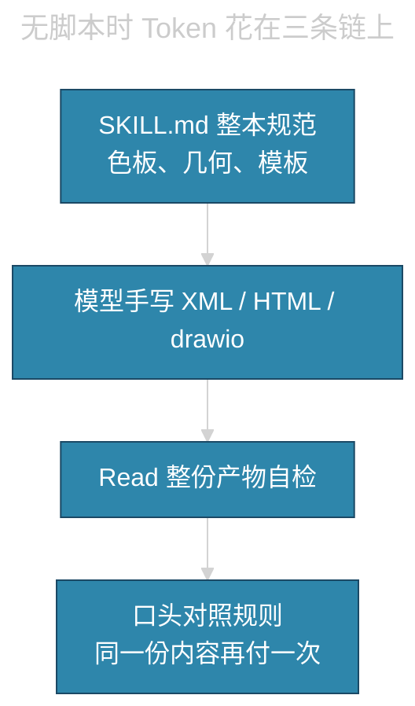
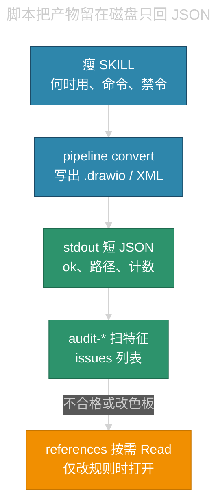
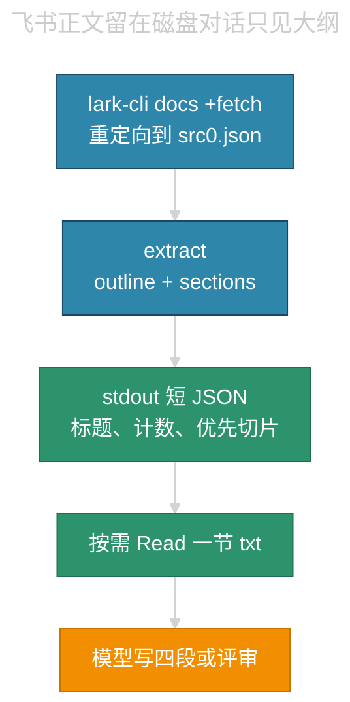

# 技能脚本为何能少耗 Token

对话里的 token 主要花在「模型看见的字」上：系统提示、Skill 正文、`Read` 进来的文件、模型自己写出来的 XML / HTML。本会话给若干 Skill 加的 Python 脚本，并不让模型变聪明；它把大块产物赶到磁盘上，只把几百字的 JSON 摘要留在对话里。

本文与任何业务仓库无关。它说明两套做法为什么比「把规范与产物都塞进聊天」便宜：

- **生成类**：短 Skill + `convert` + `audit-*`（XML / HTML / `.drawio`）
- **摄入类**：`+fetch` 重定向落盘 + `extract` 大纲；四段说明、评审意见仍由模型写

## 计费单位是上下文，不是磁盘

模型每一轮都要带着当前上下文工作。贵的是：

- **输入**：Skill 全文、`Read` 的 `.drawio` / DocxXML / 渲染 HTML、飞书 `+fetch` pretty/markdown 全文、上一轮贴进来的大段 XML
- **输出**：模型手敲的 mxfile、表格 XML、整页 HTML
- **残留**：这些字会留在会话里，后面每一轮再付一遍

磁盘上的文件、终端里脚本已经算完的结果，**只要不 `Read`、不贴回对话，就不进账单**。脚本的作用是：生成与验格式在进程里做完，对话只看见命令和摘要。

## 旧路径：规范、产物、核对都走对话

这条链上的问题叠在一起：

- 命中 Skill 时，先加载几千到上万字的手册（色板表、mxCell 样例、边角例外）。
- 模型把产物当「回复」写出来。一份时序图 `.drawio` 往往几千到几万字符。
- 为防漏格式，再 `Read` 同一份文件，等于输入再买一次。
- 核对靠自然语言，规则容易漏；漏了就再生成一轮，输出再买一次。

「写对」和「看对」用的是同一条昂贵通道。

## 新路径：进程做重活，对话只留摘要

分工可以看成编译器：

- 编译器把二进制写到磁盘；终端只报 `error: line 12`。
- 若把 `.o` 全文贴进聊天再问「看看对不对」，上下文会胀；看错误列表则不会。

`convert` 对应编译；`audit-*` 对应报错列表；`ok: true` 对应退出码 0。模型被禁止 `Read` 整份产物，也禁止手写 XML。

摄入类没有「编译产物」这一步：贵的是飞书正文进对话。`extract` 把章节写到 `sections/*.txt`，stdout 只给标题、计数、优先切片路径。模型按需 `Read` 一节，而不是整篇 fetch。

## 省在三类流量上

| 流量 | 旧做法 | 脚本做法 | 为何更便宜 |
|------|------|------|------|
| Skill 常驻输入 | 每次命中加载整本手册与长示例 | `SKILL.md` 只留编排与硬规则清单 | 命中成本从「手册」降到「目录」 |
| 生成输出 | 模型在回复里敲完整 XML | 模型只写一条 `python3 … convert` | 输出从万字符降到一行命令 |
| 核对输入 | `Read` 整份 mxfile / HTML | `audit-*` 打印 `ok` 与短 `issues` | 输入从整文件降到几百字 JSON |
| 飞书/聊天摄入 | `+fetch` pretty 打进 stdout，再 `Read` 全文 | 重定向到磁盘，`extract` 只回大纲 JSON | 万字正文不出对话；需要时只读一节切片 |
| 规范细则 | 混在 Skill 里每次都加载 | 放到 `references/`，失败或改几何时才 `Read` | 多数成功路径不打开长文 |
| 后续轮次 | 大 XML 残留在历史里反复计费 | 历史里主要是 JSON 路径与计数 | 会话越长，差额越大 |

数字直觉（量级，不是精确账单）：

- 一份时序 `.drawio`：约 5k–30k 字符。`Read` 一次就进上下文。
- 一次 `audit-drawio` 摘要：大约 `{"ok": true, "file": "…", "cells": 20, "issues": []}`，通常不到 200 字符。
- 一份飞书技术文档 fetch：常常 20k–200k 字符。`extract` 摘要通常是标题列表 + 计数，几百到一两千字符。
- 瘦 Skill 相对原 Skill：常从一百多行手册变成几十行编排。长示例不再每次附带。

省下的是「同一份字节被模型看见的次数」，不是「磁盘少写了文件」。磁盘往往写得更多、更完整；对话看见得更少。

## 脚本具体做了什么

各 Skill 的 `pipeline.py` 形态接近，命令名不同：

| 命令 | 磁盘 | stdout | 模型被允许看什么 |
|------|------|------|------|
| `convert` | 写出 `.drawio` / DocxXML / HTML | `ok`、路径、`bytes`、计数 | 只看 JSON，不看 XML 正文 |
| `extract` | `outline.json`、`source.txt`、`sections/*.txt` | 标题、表/图计数、优先切片路径 | 只看 JSON；核对某主张再 `Read` 对应切片 |
| `audit-*` | 通常不改文件 | `ok`、`issues[]`（规则名，不是整段 XML） | 只看失败条目，按 code 改源或重跑 |

硬规则从「写给模型读的散文」改成「写给脚本扫的特征」。例如：

- 时序图：矩形参与者、虚线生命线、自调用垂直向下、向右蓝向左绿、标签 `fillColor=none`
- 分层卡片：画布宽、背景色、等宽列、禁止层间 `edge`
- Markdown 图：`theme: dark`、节点 `fill`、表头 `#C9A0FF`
- 评审大纲：空/短标题、结论/风险/附录优先切片、`revision_id`

这些检查不需要把文件读进聊天。脚本在进程里打开文件、扫字符串、打印几条 issue。模型看见的是「缺生命线虚线」，不是三千行 mxCell。

`SKILL.md` 剩下的是编排：何时用、命令怎么跑、禁止手写、禁止 `Read` 全文、借口对照表。完整色板与几何仍在 `references/`，格式并不降级；降级的是「每次都把手册喂给模型」。

## 摄入类：fetch 落盘，只抽大纲

飞书成果说明、文档评审的贵处不在输出 XML，而在 **`docs +fetch` 把正文灌进对话**。四段说明和评审书脊必须人写，脚本不能过审。优化只做到大纲为止。

硬约定：

- `+fetch` 必须 `>` 落盘，禁止 pretty 打在终端里给人看。
- 禁止 `Read` fetch JSON、`source.txt` 全文。
- 认证失败才打开 `lark-doc` / `lark-shared`；成功路径直接跑 CLI。
- 画板/图片往往只有 token：按章节名与计数写，不要 fetch raw、不要虚构图内容。
- 结论依赖图却核对不了时，写「未见 / 证据不可复核」，并降级主张。

## 新政分流：写进 Skill 不等于只改散文

格式要求变多，账单会不会涨，取决于放进哪一层。可扫描规则进 `audit-*` / `extract`，对话几乎不涨；每次写中文都要用的进 `prose.md`，才会线性变贵。

「写进 Skill」若没有维护句，新对话仍可能只改 `SKILL.md`、不改脚本，下次会被旧 audit 拽回去。做法是：**只给还会涨规范、且已有脚本的 Skill 加三五行清单**，不要另做一份维护 Skill，也不要六份各复制一章。

| 类型 | 落哪里 |
|------|------|
| 色值、围栏字段、禁字面量、空章节名 | 该 Skill 的 `audit-*` / `extract` + 单测；reference 一条；本页一行 |
| 断句、专名、评审判断、四段过审 | `prose.md` / `template.md` / `checklist.md`；脚本不装会验 |
| 某类图才用、尚未脚本化的几何 | `references/`，出现条件时 Read；改 `convert`，禁止手写 XML |
| 只要这一篇、以后不守 | 不改 Skill |

命中业务 Skill 时清单已经在同一份文件里，不必赌第二份 Skill 会被打开。

## 已经按此改过的 Skill

| Skill | 脚本角色 | 模型仍负责 |
|------|------|------|
| `markdown-export` / `mermaid-flowchart-layout` | `audit_mermaid.py` | 中文断句、专名、排版判断 |
| `markdown-to-html` | `audit_html.py`、md2html | sidecar 卡片怎么排 |
| `cards-to-drawio` / `mermaid-to-drawio` | `convert` + `audit-drawio` | 文案中英、选哪张图转 |
| `weekly-report-table` | extract + convert + `audit-xml` | 三条分类合并 |
| `markdown-to-feishu-doc` | 本地 XML pipeline（更早） | 画板语义 |
| `ai-work-result-report` | 仅 `extract` 大纲 | 成果说明四段、checklist |
| `feishu-doc-review` | 仅 `extract` 大纲 | 书脊、P0/P1、矛盾 |

下一档仍同构、尚未做：个人周报的聊天 `message_list` 落盘再筛选。`markdown-to-slides`、`html-sequence-swimlane` 是中等的生成类。列着色、浏览器导入画板、官方 `lark-*` 不适合再砸脚本。

## 和「压缩提示词」不是一回事

少耗 token 的常见误会是把 Skill 删短。只删示例、不改工作方式，模型仍会手写 XML，仍会 `Read` 产物，账单马上回来。

本模式同时改了四处：

1. **加载**：短编排常驻；长规范按需。
2. **生成**：进程写文件；模型写命令（生成类）。
3. **摄入**：进程抽大纲；模型只读切片（摄入类）。
4. **验收**：特征扫描出摘要；禁止把产物或 fetch 全文当阅读材料。

少加载、少生成或少灌入、少回读，会话才明显变便宜。只瘦 Skill、不改 fetch/手写，账单马上回来。

## 故意不省的部分

| 项目 | 是否省 token | 原因 |
|------|------|------|
| 首次编写脚本与单测 | 否，当时更贵 | 成本付在改造会话；之后每次转换才便宜 |
| 中文 `prose.md` 门闩 | 否，几乎每次仍要 Read | 脚本验不了断句、专名「」、格内列义；正确性优先 |
| 改色板 / 自调用几何 / Note 块 | 否，必须打开 `references/` | 脚本没实现的分支不能靠记忆手写 XML |
| 借口表、Read 门、分流三五行 | 占用少量 Skill 字数 | 无法从外部检测模型有没有偷懒；门闩降低漏读概率 |
| `--open` 打开浏览器 | 不作为默认 | 省的是上下文，不是本机副作用 |
| 成果四段 / 评审书脊 | 否，仍要模型写 | 过审和 P0 是阅读判断；脚本只保证没把全文灌进来 |

所以：「脚本省 token」成立的前提是，模型真的只跑命令、只读 JSON。若仍把 `.drawio` `Read` 进对话「确认一下」，脚本等于白做。

## 何时这个模式划算

适合：

- 产物是结构化文本（XML、HTML、mxfile），规则能写成可扫描特征，成功路径占大多数。
- 输入是飞书 fetch / 长 Markdown，正文可以切片，真正交付仍是短文案（四段、评审）。

不适合：每次都要改尚未脚本化的几何；主要成本是业务推理而不是格式或摄入体积；列语义着色、浏览器点选导入。脚本不验「这句业务对不对」。

一句话：生成类把「写格式 / 验格式」挪到进程；摄入类把「读全文」换成「读大纲和切片」。对话里只留编排和摘要。磁盘更忙，上下文更空，token 才降下来。
